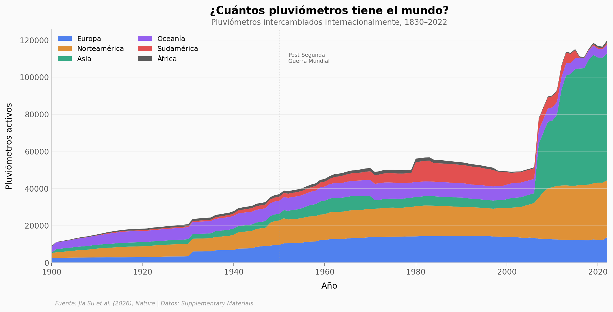

# Nadie sabe realmente cuánto llueve en casi todo el planeta

221.483 pluviómetros miden la lluvia en todo el mundo. Suena a mucho — pero el 68,7% de la superficie terrestre no tiene ni uno. África tiene 93% de su territorio sin cobertura. Solo el 13,4% del suelo global cumple los estándares mínimos de la WMO.

**El hallazgo:** Europa tiene ~33 veces más densidad de pluviómetros que África. Y aun así, el 41% de Europa no tiene cobertura.

## Gráfica clave



## Reproducir

[](https://colab.research.google.com/github/Ciencia-a-Mordiscos/lab/blob/main/papers/2026-04-02-lluvia-pluviometros-planeta/notebook.ipynb)

O localmente:
```bash
pip install pandas matplotlib numpy scipy
jupyter execute notebook.ipynb
```

## Datos

- `datos/pluviometros_por_continente.csv` — Serie temporal 1830-2022, pluviómetros por continente (1.158 filas)
- `datos/densidad_grid.csv` — Grid global 1°×1° con densidad y clasificación WMO (15.386 tiles)

## Links

- **Video:** [Ver en YouTube](https://youtube.com/watch?v=MqWTVSmBuVI)
- **Paper:** [Nature — DOI: 10.1038/s41586-026-10300-5](https://doi.org/10.1038/s41586-026-10300-5)
- **Datos completos:** [Zenodo 18364510](https://zenodo.org/records/18364510)
