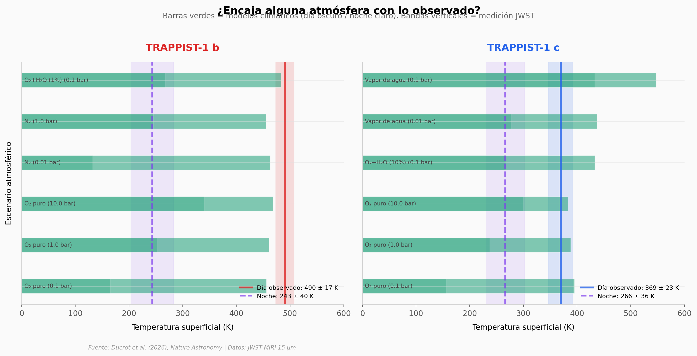

# TRAPPIST-1 b y c: rocas desnudas a 40 años-luz

El James Webb Space Telescope observó durante más de 52 horas continuas los dos planetas más cercanos a la estrella TRAPPIST-1 — a solo 40 años-luz — midiendo su calor a 15 μm. Los datos muestran que TRAPPIST-1 b alcanza 490 ± 17 K de día y prácticamente cero emisión de noche: una roca oscura sin atmósfera. TRAPPIST-1 c (369 ± 23 K de día) también carece de atmósfera densa, aunque no se descarta una capa tenue de oxígeno.

**El hallazgo:** Presiones atmosféricas superiores a ~1 bar están descartadas para ambos planetas. Son mundos desnudos.

## Gráfica clave



## Reproducir

[](https://colab.research.google.com/github/Ciencia-a-Mordiscos/lab/blob/main/papers/2026-04-03-trappist-1-sin-atmosfera-jwst/notebook.ipynb)

O localmente:
```bash
pip install pandas matplotlib numpy
jupyter execute notebook.ipynb
```

## Datos

- `datos/curva_fase_obs.csv` — Curva de fase GO 3077 binned (207 puntos, 15 min)
- `datos/curva_fase_modelo.csv` — Modelo best-fit (4.501 puntos)
- `datos/mcmc_chunk0.csv` — Posterior MCMC flujo diurno planeta b (120K muestras)
- `datos/mcmc_chunk3.csv` — Posterior MCMC flujo diurno planeta c (120K muestras)
- `datos/modelos_climaticos.csv` — Predicciones de 12 escenarios atmosféricos (SM Table 6)
- `datos/temperaturas_analisis.csv` — Temperaturas de brillo de 4 análisis independientes

## Links

- **Video:** [Pendiente]
- **Paper:** [Nature Astronomy — DOI: 10.1038/s41550-026-02806-9](https://doi.org/10.1038/s41550-026-02806-9)
- **Datos originales:** [MAST (JWST Programme 3077)](https://mast.stsci.edu) + Supplementary Materials
