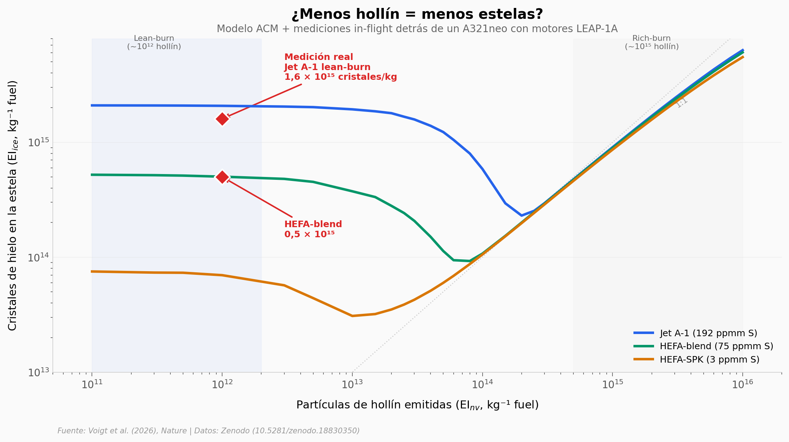

# Las estelas de los aviones "limpios" siguen calentando el planeta

Los motores de nueva generación (lean-burn) eliminan el 99,9% del hollín — pero las estelas de condensación siguen formándose con la misma intensidad. Los cristales de hielo nuclean sobre partículas volátiles (compuestos de azufre, orgánicos y vapores de aceite lubricante) que los motores limpios no reducen.

**El hallazgo:** 1,6 × 10¹⁵ cristales de hielo por kg de combustible en lean-burn — 1.000× más que el hollín emitido. Solo el combustible bajo en azufre reduce las estelas (~3×).

## Gráfica clave



## Reproducir

[](https://colab.research.google.com/github/Ciencia-a-Mordiscos/lab/blob/main/papers/2026-04-04-estelas-avion-motor-bajo-hollin/notebook.ipynb)

O localmente:
```bash
pip install pandas matplotlib numpy scipy
jupyter execute notebook.ipynb
```

## Datos

- `datos/curvas_acm_combustibles.csv` — Modelo ACM: hollín vs cristales de hielo para 3 combustibles (102 puntos)
- `datos/curvas_acm_temperaturas.csv` — Modelo ACM: sensibilidad a temperatura (204 puntos, 2 fuels × 3 temps)
- `datos/mediciones_vuelo.csv` — Mediciones in-flight detrás del A321neo (5 registros)

## Links

- **Video:** [Pendiente]
- **Paper:** [Nature — DOI: 10.1038/s41586-026-10286-0](https://doi.org/10.1038/s41586-026-10286-0)
- **Datos originales:** [Zenodo](https://doi.org/10.5281/zenodo.18830350) + [HALO-DB](https://halo-db.pa.op.dlr.de/)
