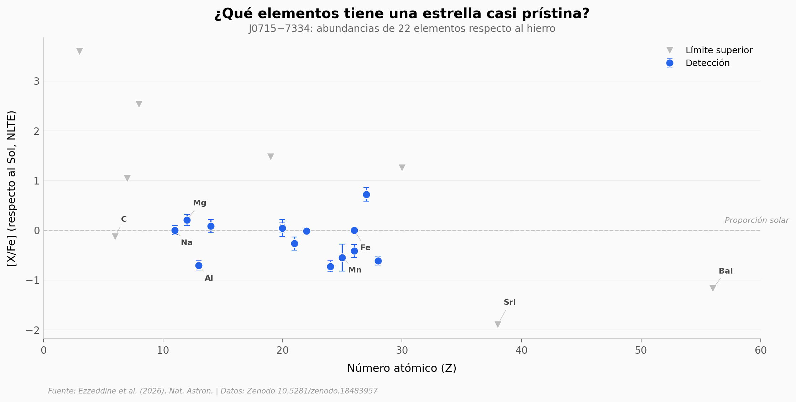

# Una Estrella Casi Prístina de la Nube Mayor de Magallanes

SDSS J0715−7334 tiene unas 20.000 veces menos hierro que el Sol — una de las estrellas más metal-poor conocidas. Su análisis espectroscópico revela la huella química de una sola supernova primordial de ~30 masas solares. Es la única estrella ultra metal-poor de la muestra que NO está enriquecida en carbono, desafiando el patrón esperado.

**El hallazgo:** De las 15 estrellas con [Fe/H] < −4,5 conocidas, 14 son CEMP (enriquecidas en carbono). J0715 es la única que no lo es ([C/Fe] = −0,01), lo que sugiere formación por enfriamiento de polvo tras una supernova primordial.

## Gráfica clave



## Reproducir

[](https://colab.research.google.com/github/Ciencia-a-Mordiscos/lab/blob/main/papers/2026-04-04-estrella-pristina-nube-magallanes/notebook.ipynb)

O localmente:
```bash
pip install pandas matplotlib numpy scipy
jupyter execute notebook.ipynb
```

## Datos

- `datos/abundancias_j0715.csv` — 22 elementos, abundancias LTE y NLTE con incertidumbres
- `datos/muestra_ump.csv` — 39 estrellas ultra metal-poor (metalicidades, carbono, cinemática)
- `datos/espectro_j0715.csv` — Espectro MIKE normalizado, 86.464 puntos (3.328-9.398 Å)

## Links

- **Video:** [Pendiente]
- **Paper:** [Nature Astronomy — DOI: 10.1038/s41550-026-02816-7](https://doi.org/10.1038/s41550-026-02816-7)
- **Datos originales:** [Zenodo — 10.5281/zenodo.18483957](https://doi.org/10.5281/zenodo.18483957)
