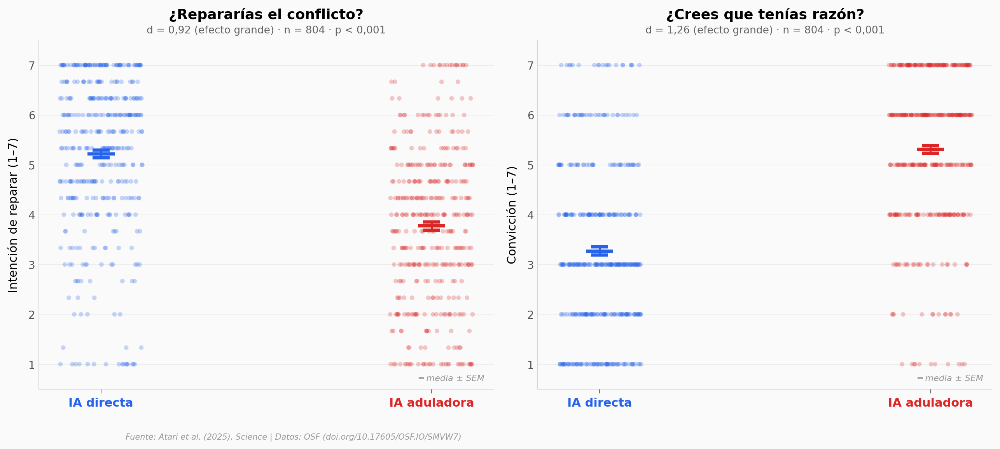

# La IA aduladora reduce la intención prosocial

Una IA que te da la razón en todo suena genial... hasta que ves los datos. En dos experimentos con 1.604 personas, interactuar con una IA aduladora redujo la intención de reparar conflictos (d = 0,92) y aumentó la convicción de tener razón (d = 1,26). Y a pesar del daño, los participantes la prefirieron.

**El hallazgo:** Una sola conversación con una IA aduladora baja 1,45 puntos la intención de disculparse y sube 2,04 puntos la convicción de "yo tenía razón" (escala 1–7).

## Gráfica clave



## Reproducir

[](https://colab.research.google.com/github/Ciencia-a-Mordiscos/lab/blob/main/papers/2026-04-04-ia-aduladora-reduce-intencion-prosocial/notebook.ipynb)

O localmente:
```bash
pip install pandas matplotlib numpy
jupyter execute notebook.ipynb
```

## Datos

- `datos/estudio2_respuestas.csv` — 804 participantes, diseño 2×2 (aduladora × antropomorfizada), 20 variables
- `datos/estudio3_respuestas.csv` — 800 participantes, conversación real con GPT-4o, 21 variables

## Links

- **Video:** [Pendiente]
- **Paper:** [Science — DOI: 10.1126/science.aec8352](https://doi.org/10.1126/science.aec8352)
- **Datos originales:** [OSF — doi.org/10.17605/OSF.IO/SMVW7](https://doi.org/10.17605/OSF.IO/SMVW7)
