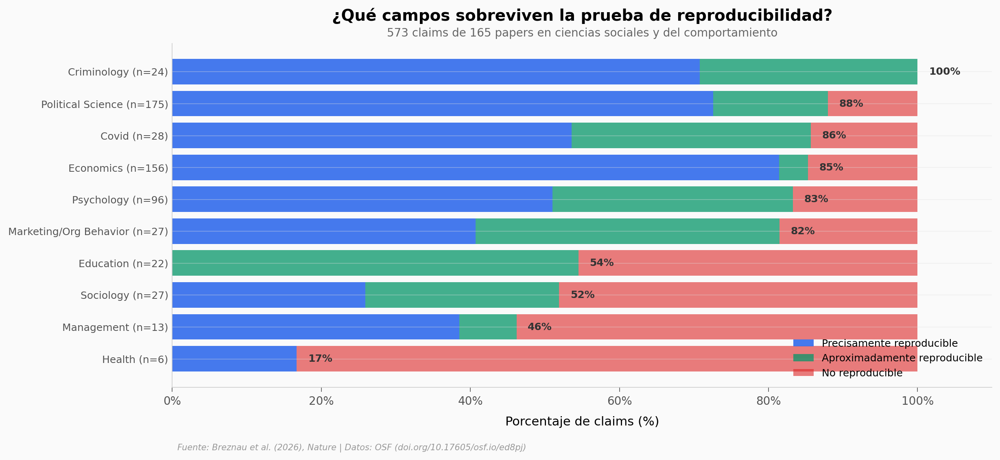

# ¿Se Puede Confiar en la Ciencia Social?

600 papers de ciencias sociales y del comportamiento, 62 revistas, una década de publicaciones (2009–2018). El proyecto SCORE evaluó si los resultados científicos sobreviven una prueba simple: repetir el análisis con los mismos datos. Solo el 20% compartió sus datos, y de los evaluados, el 55% fue precisamente reproducible.

**El hallazgo:** Solo el 55,5% de los papers evaluados son precisamente reproducibles — y el cuello de botella no es la estadística, sino que el 80% de los papers ni siquiera comparten datos.

## Gráfica clave



## Reproducir

[](https://colab.research.google.com/github/Ciencia-a-Mordiscos/lab/blob/main/papers/2026-04-04-reproducibilidad-ciencias-sociales/notebook.ipynb)

O localmente:
```bash
pip install pandas matplotlib numpy
jupyter execute notebook.ipynb
```

## Datos

- `datos/reproducibilidad_por_campo.csv` — Reproducibilidad por campo (10 campos, 573 claims)
- `datos/reproducibilidad_por_anio.csv` — Tendencia temporal (2009–2018 + COVID 2020)
- `datos/disponibilidad_datos.csv` — Disponibilidad de datos por disciplina (10 disciplinas)
- `datos/diferencias_p_values.csv` — Diferencias de p-value entre original y reproducción (421 claims)
- `datos/politicas_revistas.csv` — Políticas de datos de 62 revistas
- `datos/resumen_global.csv` — Resumen de métricas globales

## Links

- **Video:** [Pendiente]
- **Paper:** [Nature — DOI: 10.1038/s41586-026-10203-5](https://doi.org/10.1038/s41586-026-10203-5)
- **Datos originales:** [OSF — Materials for SCORE](https://doi.org/10.17605/osf.io/ed8pj)
