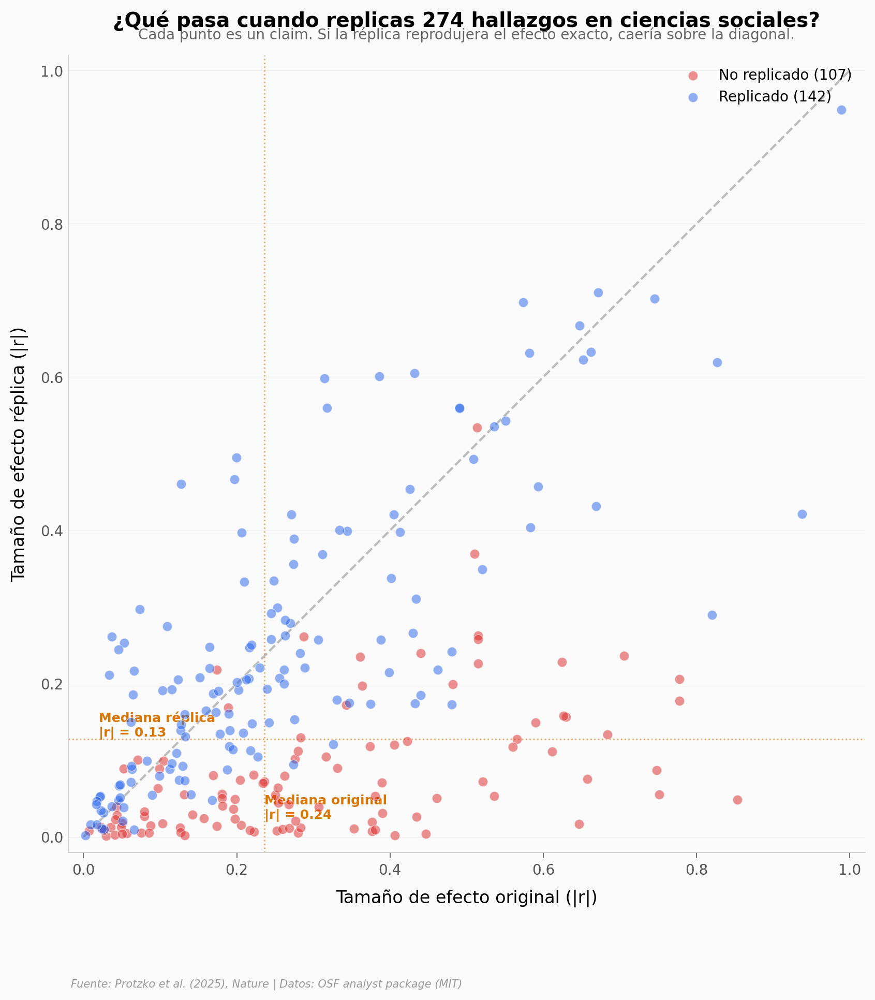

# ¿Se Puede Replicar la Ciencia Social?

Un equipo de cientos de investigadores intentó replicar 274 hallazgos positivos de 164 papers publicados entre 2009 y 2018 en 54 revistas de ciencias sociales y del comportamiento. Solo el 55% se replicó, y los efectos se redujeron a menos de la mitad.

**El hallazgo:** De 274 claims replicados con alto poder estadístico (mediana 99,6%), solo 151 (55,1%) mostraron resultados significativos en la dirección original. El efecto mediano se redujo de |r| = 0,24 a |r| = 0,13.

## Gráfica clave



## Reproducir

[](https://colab.research.google.com/github/Ciencia-a-Mordiscos/lab/blob/main/papers/2026-04-05-replicabilidad-ciencias-sociales/notebook.ipynb)

O localmente:
```bash
pip install pandas matplotlib numpy
jupyter execute notebook.ipynb
```

## Datos

- `datos/efecto_original_vs_replica.csv` — 274 claims con tamaño de efecto original y replicado, campo, p-value
- `datos/replicabilidad_por_campo.csv` — Tasa de replicación por disciplina (10 campos)
- `datos/metodos_evaluacion_replica.csv` — 12 métodos de evaluación de replicación

## Links

- **Video:** [Pendiente]
- **Paper:** [Nature — DOI: 10.1038/s41586-025-10078-y](https://doi.org/10.1038/s41586-025-10078-y)
- **Datos originales:** [OSF — Analyst package (MIT)](https://doi.org/10.17605/OSF.IO/BZFGY)
