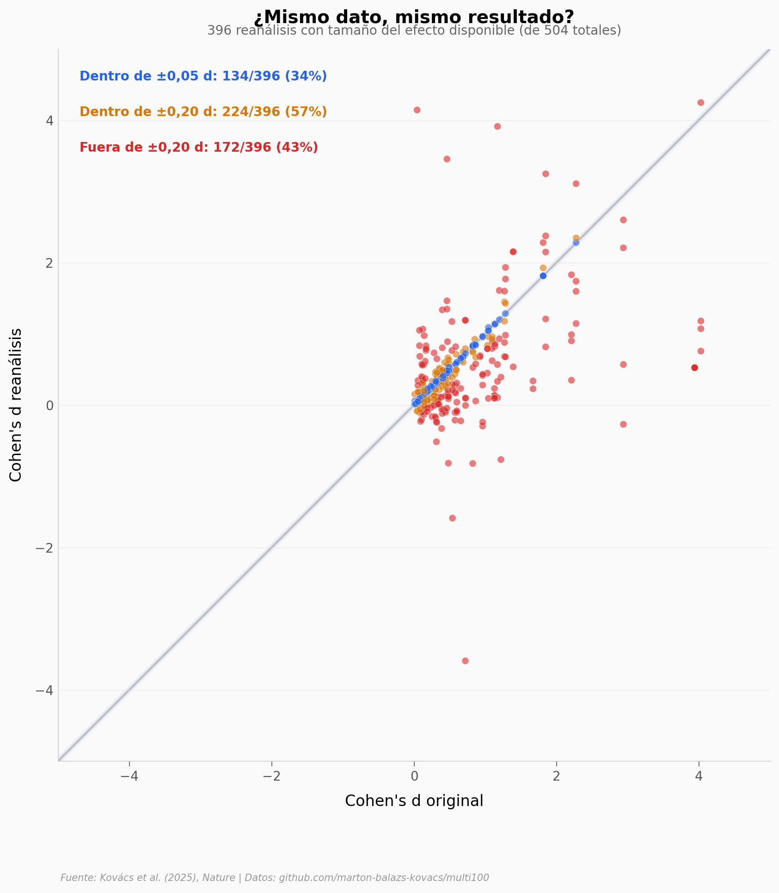

# ¿Se Puede Confiar en un Solo Análisis?

504 reanálisis independientes de 100 estudios en ciencias sociales revelan que las decisiones analíticas importan más de lo que pensamos. Solo el 34% produce un resultado prácticamente idéntico al original. Tres de cada cuatro llegan a la misma conclusión... pero uno de cada cuatro no.

**El hallazgo:** Cuando múltiples analistas procesan los mismos datos con métodos igual de válidos, el 74% llegan a la misma conclusión, pero solo el 34% obtienen el mismo tamaño del efecto (±0,05 Cohen's d).

## Gráfica clave



## Reproducir

[](https://colab.research.google.com/github/Ciencia-a-Mordiscos/lab/blob/main/papers/2026-04-05-robustez-analitica-ciencias-sociales/notebook.ipynb)

O localmente:
```bash
pip install pandas matplotlib numpy scipy
jupyter execute notebook.ipynb
```

## Datos

- `datos/efectos_original_vs_reanalisis.csv` — 504 reanálisis, con Cohen's d original y reanálisis, conclusión, disciplina
- `datos/robustez_por_paper.csv` — 100 papers, con % de acuerdo, disciplina, diseño
- `datos/conclusiones_por_disciplina.csv` — 8 disciplinas con tasas de acuerdo

## Links

- **Video:** [Pendiente]
- **Paper:** [Nature — DOI: 10.1038/s41586-025-09844-9](https://doi.org/10.1038/s41586-025-09844-9)
- **Datos originales:** [github.com/marton-balazs-kovacs/multi100](https://github.com/marton-balazs-kovacs/multi100)
