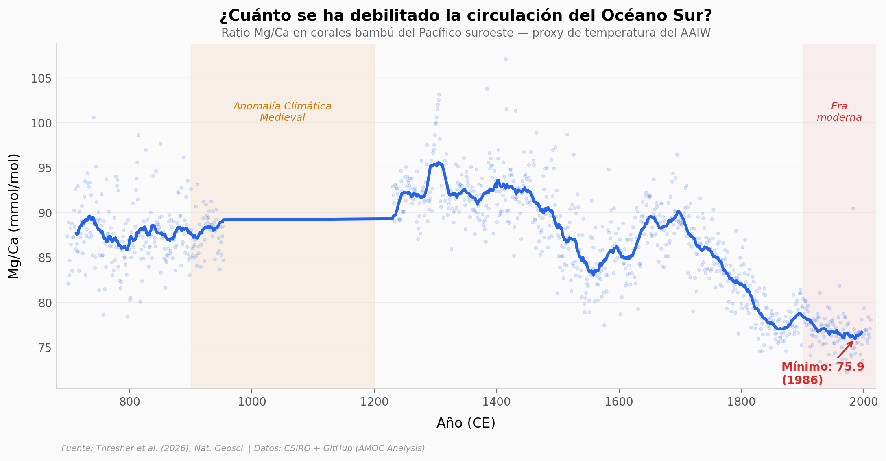

# La corriente que mueve el calor del planeta se está debilitando — y el Océano Sur se adelantó

La circulación meridional de vuelco (AMOC) transporta calor, carbono y nutrientes entre hemisferios. Un equipo australiano analizó la química de corales bambú de aguas profundas del Pacífico suroeste para reconstruir la circulación del Océano Sur durante los últimos 1.300 años. Los datos muestran que ambas — la circulación del Océano Sur y la del Atlántico Norte — están en su punto más débil del último milenio, y que los cambios en el Sur preceden a los del Norte por 20 a 50 años.

**El hallazgo:** La media moderna del proxy Mg/Ca (76,8 mmol/mol) se ubica en el percentil 8 de los últimos 1.313 años — en el 92% de ese período, la circulación fue más fuerte que ahora.

## Gráfica clave



## Reproducir

[](https://colab.research.google.com/github/Ciencia-a-Mordiscos/lab/blob/main/papers/2026-04-06-circulacion-atlantico-oceano-sur/notebook.ipynb)

O localmente:
```bash
pip install pandas matplotlib numpy scipy
jupyter execute notebook.ipynb
```

## Datos

- `datos/aaiw_proxy_mgca.csv` — Proxy Mg/Ca de circulación del Océano Sur (1.038 puntos, 698–2011 CE)
- `datos/rahmstorf_amoc_index.csv` — Índice AMOC del Atlántico Norte (1.096 puntos, 900–1995 CE)
- `datos/caesar_amoc_proxy.csv` — Proxy AMOC moderno (146 puntos, 1871–2016 CE)

## Links

- **Video:** [Pendiente]
- **Paper:** [Nature Geoscience — DOI: 10.1038/s41561-026-01959-6](https://doi.org/10.1038/s41561-026-01959-6)
- **Datos originales:** [CSIRO Data Collection](https://doi.org/10.25919/9dqy-2x95) + [GitHub (AMOC Analysis)](https://github.com/ncahill89/AMOC-Analysis)
