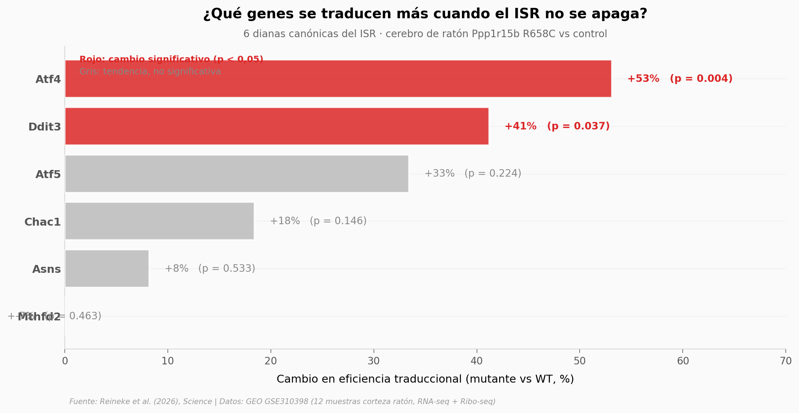

# Una proteína viral le devolvió la memoria a ratones con deterioro cognitivo

Una variante humana del gen PPP1R15B mantiene encendida una respuesta de estrés celular llamada ISR — y eso solo basta para deteriorar la memoria. El paper muestra que una proteína viral, **DP71L**, la apaga y revierte los déficits cognitivos en ratones con Down, Alzheimer y envejecimiento. Este notebook usa los datos públicos para verificar la firma molecular del ISR persistente en el cerebro mutante.

**El hallazgo:** **ATF4 sube su eficiencia traduccional 53% en ratones Ppp1r15b R658C** (p ≈ 0,005, Cohen's d ≈ 5) — la firma canónica del ISR encendido — pero solo 1,6% de los 10.908 genes cambian, demostrando que el efecto es selectivo, no global.

## Gráfica clave



## Reproducir

[](https://colab.research.google.com/github/Ciencia-a-Mordiscos/lab/blob/main/papers/2026-04-06-viral-dp71l-reverso-deterioro-cognitivo/notebook.ipynb)

O localmente:
```bash
pip install pandas matplotlib numpy scipy
jupyter execute notebook.ipynb
```

## Datos

- `datos/isr_targets_summary.csv` — 6 dianas canónicas del ISR (Atf4, Ddit3/CHOP, Atf5, Chac1, Asns, Mthfd2) con cambios % en RNA y eficiencia traduccional + p-valores
- `datos/te_analysis.csv` — análisis de eficiencia traduccional (TE = Ribo_RPKM / RNA_RPKM) por gen, 10.910 genes expresados
- `datos/rpkm_per_sample.csv` — RPKM por gen por muestra (12 muestras: 2 ensayos × 2 genotipos × 3 réplicas)

Generados desde [GSE310398](https://www.ncbi.nlm.nih.gov/geo/query/acc.cgi?acc=GSE310398) (BioProject PRJNA1365879).

## Links

- **Video:** *Pendiente*
- **Paper:** [Science — DOI: 10.1126/science.aea8782](https://doi.org/10.1126/science.aea8782)
- **Datos originales:** [GEO GSE310398](https://www.ncbi.nlm.nih.gov/geo/query/acc.cgi?acc=GSE310398)
- **Estructura cryo-EM del complejo viral:** [PDB 9NB9](https://www.rcsb.org/structure/9NB9)
