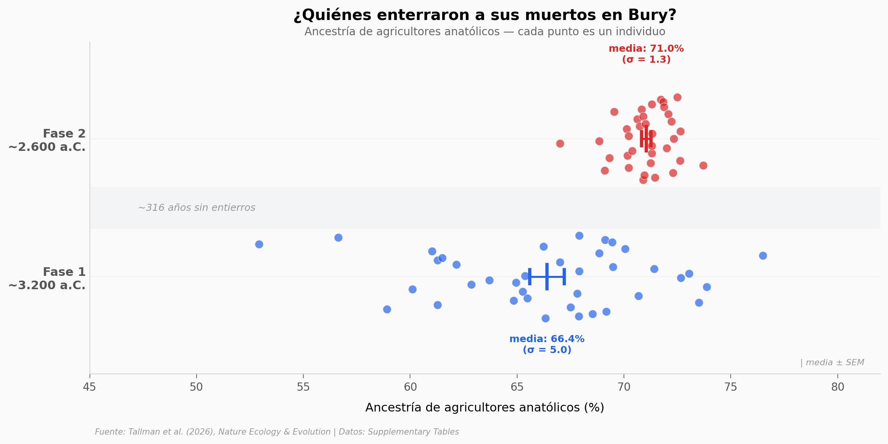

# Discontinuidad genética en la Cuenca de París al final del Neolítico

132 genomas antiguos de una tumba colectiva cerca de París revelan que dos fases de entierro — separadas por ~316 años sin actividad funeraria — pertenecían a grupos genéticamente distintos. La Fase 1 (~3.200 a.C.) tenía una comunidad diversa con amplia variación en ancestría de agricultores anatólicos (52,9%–76,5%). La Fase 2 (~2.600 a.C.) muestra un grupo homogéneo con más ancestría agrícola (71,0%), 5 veces más individuos de posible origen no local, y evidencia de *Yersinia pestis* en ambas fases.

**El hallazgo:** Un recambio poblacional completo durante el declive neolítico — pero en Francia, no fueron los pastores de las estepas quienes reemplazaron a los agricultores. Fueron otros agricultores, venidos del sur.

## Gráfica clave



## Reproducir

[](https://colab.research.google.com/github/Ciencia-a-Mordiscos/lab/blob/main/papers/2026-04-07-discontinuidad-paris-neolitico/notebook.ipynb)

O localmente:
```bash
pip install pandas matplotlib numpy scipy
jupyter execute notebook.ipynb
```

## Datos

- `datos/individuos.csv` — 178 individuos, fase de entierro, sexo, haplogrupos, edad calibrada
- `datos/ancestria_distal.csv` — 80 modelos de ancestría (proporción agricultores anatólicos vs cazadores-recolectores)
- `datos/dataciones.csv` — 18 dataciones radiocarbónicas calibradas con isótopos δ13C/δ15N
- `datos/enfermedades.csv` — 120 detecciones de patógenos (40 especies) en 71 individuos
- `datos/estroncio.csv` — 190 mediciones de ⁸⁷Sr/⁸⁶Sr para análisis de movilidad

## Links

- **Video:** [Pendiente]
- **Paper:** [Nature Ecology & Evolution — DOI: 10.1038/s41559-026-03027-z](https://doi.org/10.1038/s41559-026-03027-z)
- **Datos originales:** [Supplementary Tables (Nature)](https://www.nature.com/articles/s41559-026-03027-z#Sec30)
- **Genomas:** [European Nucleotide Archive — PRJEB95770](https://www.ebi.ac.uk/ena/browser/view/PRJEB95770)
