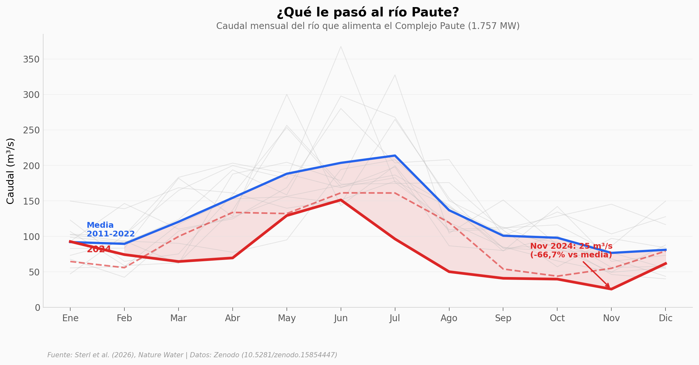

# Renovables Fortalecen a Ecuador Contra la Sequía

En 2024, Ecuador sufrió apagones diarios de hasta 12 horas. El 70% de su electricidad viene de represas, y dos temporadas de lluvia consecutivas fallaron. El río Paute — que alimenta el complejo hidroeléctrico más importante del país — cayó un 42,4% respecto a su media histórica.

**El hallazgo:** Un despliegue de 613 MW de solar + 613 MW de eólica habría generado entre 388 y 548 MW promedio durante los meses críticos, compensando parcialmente el déficit hídrico. El "crédito de capacidad indirecto" de las renovables alcanza el 59% (50-65%): por cada MW instalado, se necesitan ~0,6 MW menos de respaldo fósil.

## Gráfica clave



## Reproducir

[](https://colab.research.google.com/github/Ciencia-a-Mordiscos/lab/blob/main/papers/2026-04-07-renovables-fortalecen-ecuador-sequia/notebook.ipynb)

O localmente:
```bash
pip install pandas matplotlib numpy openpyxl
jupyter execute notebook.ipynb
```

## Datos

- `datos/caudal_mensual_paute.csv` — Caudal mensual del río Paute, 168 puntos (14 años × 12 meses)
- `datos/factores_capacidad_mensual.csv` — CFs solar y eólica mensuales para Ecuador
- `datos/caudal_anual_paute.csv` — Media anual del caudal del Paute (14 años)
- `datos/caudal_total_mensual.csv` — Caudal total mensual de las 6 plantas principales

## Links

- **Video:** [Pendiente]
- **Paper:** [Nature Water — DOI: 10.1038/s44221-026-00617-w](https://doi.org/10.1038/s44221-026-00617-w)
- **Datos originales:** [Zenodo (10.5281/zenodo.15854447)](https://doi.org/10.5281/zenodo.15854447)
