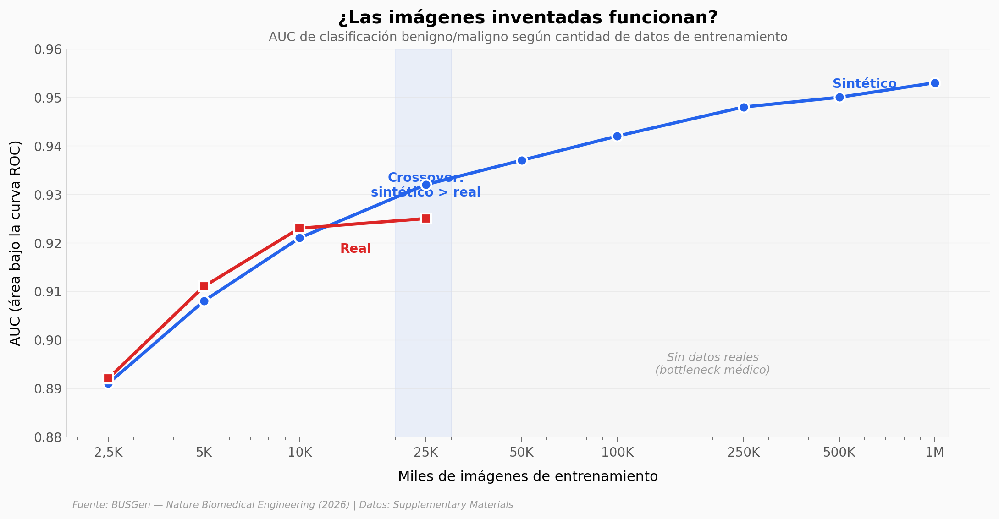

# ¿Puede una IA entrenada con imágenes inventadas superar a 9 radiólogos?

BUSGen es el primer modelo generativo fundacional diseñado para ecografía mamaria. Pre-entrenado con 3,5 millones de imágenes, genera ecografías sintéticas tan realistas que los modelos entrenados con ellas superan a los entrenados con datos reales — y al evaluar screening de cáncer de mama, la IA supera en sensibilidad a los 9 radiólogos certificados que participaron en el estudio.

**El hallazgo:** A partir de 25.000 imágenes de entrenamiento, los datos sintéticos superan a los reales (AUC 0,932 vs 0,925). A 1 millón de imágenes sintéticas, el AUC alcanza 0,953 — una escala imposible con datos reales por el cuello de botella de privacidad médica.

## Gráfica clave



## Reproducir

[](https://colab.research.google.com/github/Ciencia-a-Mordiscos/lab/blob/main/papers/2026-04-08-busgen-ecografia-mama-ia/notebook.ipynb)

O localmente:
```bash
pip install pandas matplotlib numpy
jupyter execute notebook.ipynb
```

## Datos

- `datos/scaling_auc.csv` — AUC por escala de datos (9 escalas, 2.5K–1M)
- `datos/roc_screening.csv` — Curva ROC del screening (57 puntos)
- `datos/readers_screening.csv` — Puntos operativos de 9 radiólogos (screening, 3 umbrales)
- `datos/accuracy_readers.csv` — Accuracy con y sin asistencia IA (9 radiólogos × 2 condiciones)
- `datos/roc_diagnosis.csv` — Curva ROC del diagnóstico (40 puntos)
- `datos/readers_diagnosis.csv` — Puntos operativos de 9 radiólogos (diagnóstico, 3 umbrales)

## Links

- **Video:** [Pendiente]
- **Paper:** [Nature Biomedical Engineering — DOI: 10.1038/s41551-026-01639-1](https://doi.org/10.1038/s41551-026-01639-1)
- **Datos originales:** [Supplementary Materials (Nature)](https://www.nature.com/articles/s41551-026-01639-1#Sec31)
