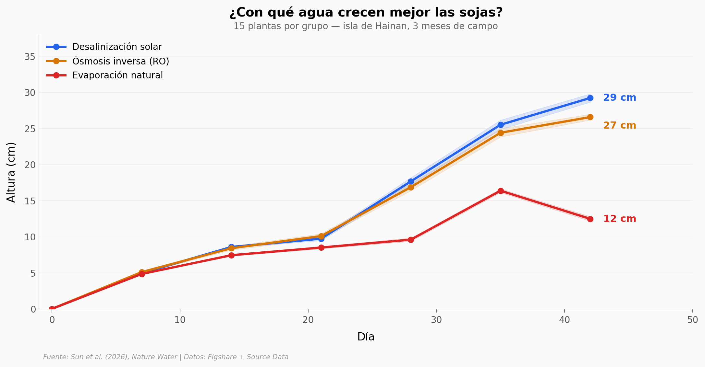

# Agricultura circular con agua de mar y sol

Un equipo en la isla de Hainan construyó un sistema agrícola que usa solo agua de mar y energía solar. El sol destila el agua, los cultivos crecen, y los residuos de la cosecha se convierten en nuevos evaporadores y fertilizante. Tres meses de campo. Cuatro cultivos. Cero agua dulce.

**El hallazgo:** Las sojas regadas con destilado solar crecen un **134%** más que con evaporación natural y producen un **49%** más de semilla que las regadas con ósmosis inversa industrial. Escalado a 0,6 hectáreas, el sistema alimenta a 47 personas.

## Gráfica clave



## Reproducir

[](https://colab.research.google.com/github/Ciencia-a-Mordiscos/lab/blob/main/papers/2026-04-08-desalinizacion-solar-agricultura-circular/notebook.ipynb)

O localmente:
```bash
pip install pandas matplotlib numpy scipy
jupyter execute notebook.ipynb
```

## Datos

- `datos/altura_plantas.csv` — Altura de 15 plantas × 3 métodos de riego × 7 mediciones (días 0-42)
- `datos/calidad_agua.csv` — Composición del agua: mar, RO, destilado solar (5 parámetros)
- `datos/rendimiento_cultivos.csv` — Peso fresco y seco de 4 cultivos × 2 métodos × 6 réplicas
- `datos/rendimiento_soja.csv` — Biomasa, vainas y semilla de soja (9 plantas × 2 métodos)
- `datos/estabilidad_operacion.csv` — Tasa de purificación solar durante 30 días
- `datos/remediacion_suelo.csv` — Conductividad y contenido de agua del suelo (15 días)
- `datos/germinacion_soja.csv` — Tasa de germinación a 24, 48 y 72 horas

## Links

- **Video:** [Pendiente]
- **Paper:** [Nature Water — DOI: 10.1038/s44221-026-00615-y](https://doi.org/10.1038/s44221-026-00615-y)
- **Datos originales:** [Figshare](https://doi.org/10.6084/m9.figshare.30962279)
