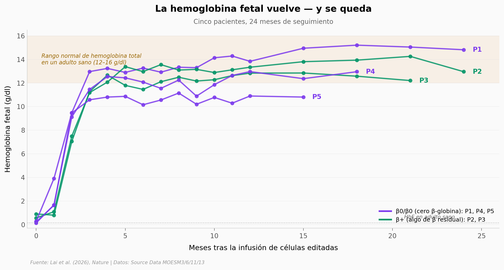

# 5 pacientes con β-talasemia, 23 meses sin transfusiones

Lai et al. (Nature, 2026) reportan los resultados de un trial Fase 1 (NCT06024876) en 5 pacientes con β-talasemia tratados con CS-101: células madre CD34+ propias del paciente, editadas con un *base editor* para desactivar el sitio donde el represor BCL11A apaga los genes de hemoglobina fetal (HbF). Tras la infusión, los 5 dejaron las transfusiones. La mediana de tiempo a la última transfusión fue **18 días**. La hemoglobina total a 3 meses promedió **12,4 ± 1,0 g/dl** (rango normal: 12–16). La HbF subió **31×** desde el baseline al año 1.

**El hallazgo:** **3 de los 5 pacientes son β0/β0 — no producen ni una molécula de hemoglobina adulta. Su sangre es 99–100% fetal y aun así viven sin transfusiones.**

## Gráfica clave



## Reproducir

[](https://colab.research.google.com/github/Ciencia-a-Mordiscos/lab/blob/main/papers/2026-04-08-edicion-bases-beta-talasemia-clinico/notebook.ipynb)

O localmente:

```bash
pip install pandas matplotlib numpy scipy
jupyter execute notebook.ipynb
```

## Datos

- `datos/eficiencia_edicion_invitro.csv` — 10 mediciones (NT vs Editadas × 5 réplicas pareadas por lote). Fig 1c del paper.
- `datos/edicion_pbmc_temporal.csv` — 76 mediciones de frecuencia de edición en sangre periférica (5 pacientes × baseline a 21 meses). Fig 4a.
- `datos/hemoglobina_temporal.csv` — 79 mediciones de HbF, HbA, HbA₂ y total por paciente (5 pacientes × baseline a 24 meses). Extended Data Fig 7c.
- `datos/globinas_periferica.csv` — composición final de globinas por paciente (α, β, δ, γG, γA). β=NaN indica genotipo β0/β0 sin β-globina endógena. Extended Data Fig 9b.

## Verificación rápida

| Claim del paper | Nuestro cálculo | ¿Coincide? |
|---|---|---|
| Hb total mes 3: 12,4 ± 1,0 g/dl | 12,44 ± 1,04 | ✅ |
| HbF mes 3: 11,5 ± 0,9 g/dl | 11,48 ± 0,89 | ✅ |
| Edición in vitro NT vs Editadas | Wilcoxon pareado: W=15, p=0,031, dz=68,7 | ✅ separación total |

## Limitaciones que el notebook respeta

- **N=5 sin grupo control** — no comparable contra otras terapias (Casgevy, lentiviral, alogénico) sin head-to-head.
- **Mediana 23 meses** — seguimiento intermedio, no "a largo plazo".
- **Mieloablación con busulfán** — el procedimiento incluye destruir la médula previamente. La novedad es la fuente de las células, no el protocolo completo.

## Links

- **Video:** [Pendiente]
- **Paper:** [*Nature* — DOI: 10.1038/s41586-026-10342-9](https://doi.org/10.1038/s41586-026-10342-9)
- **Trial:** [ClinicalTrials.gov NCT06024876](https://clinicaltrials.gov/study/NCT06024876)
- **Datos originales:** Source Data MOESM3, MOESM6, MOESM11 y MOESM13 del [paper en Nature](https://www.nature.com/articles/s41586-026-10342-9#Sec)
