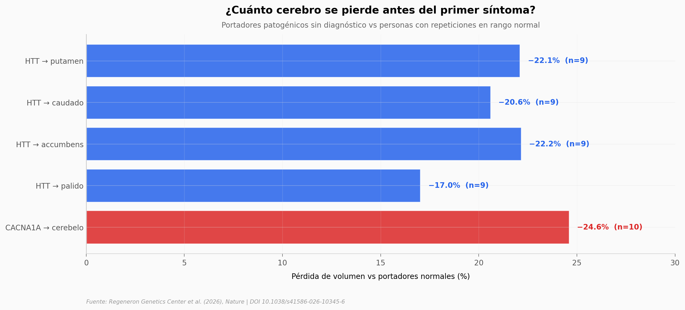

# Expansiones STR a escala poblacional revelan atrofia cerebral preclínica

Un equipo del Regeneron Genetics Center cruzó las longitudes de 37 repeticiones cortas en tándem (STRs) patogénicas con 7.671 rasgos clínicos en **1.020.833 personas**. Recuperaron las asociaciones canónicas (HTT con Huntington, DMPK con distrofia miotónica, C9ORF72 con motoneurona) con razones de probabilidades de cientos a miles. Y al cruzar la longitud de las repeticiones con imágenes cerebrales, encontraron lo más sorprendente del paper.

**El hallazgo:** En portadores de la expansión patogénica de **HTT que aún no están diagnosticados**, el putamen aparece un **22,1% más pequeño** (n=9, p = 1,4·10⁻¹⁸); en portadores de **CACNA1A**, el cerebelo aparece un **24,6% más pequeño** (n=10). Las observaciones del paper sugieren que la atrofia y los biomarcadores en sangre **parecen preceder al diagnóstico clínico** — con la advertencia honesta de que el estudio es transversal y los `n` son chicos.

## Gráfica clave



## Reproducir

[](https://colab.research.google.com/github/Ciencia-a-Mordiscos/lab/blob/main/papers/2026-04-08-repeticiones-str-atrofia-cerebral/notebook.ipynb)

O localmente:
```bash
pip install pandas matplotlib numpy
jupyter execute notebook.ipynb
```

## Datos

- `datos/atrofia_cerebral.csv` — Pérdida porcentual de volumen cerebral en 4 regiones HTT + 1 región CACNA1A (5 filas).
- `datos/phewas_top.csv` — Top hits PheWAS con odds ratios e IC95% para 6 asociaciones STR-enfermedad (HTT-HD, DMPK-DM1, C9ORF72-MND, TCF4-corneal).
- `datos/portadores_vs_prevalencia.csv` — Frecuencias de portadores patogénicos por 100.000 vs prevalencia clínica para 4 enfermedades.
- `datos/nfl_fold_change.csv` — Fold-change de NfL plasmático en portadores vs normales (3 loci).
- `datos/frecuencias_por_ancestralidad.csv` — Frecuencias de premutación y patogénicos por locus (35 loci) y ancestralidad (5 grupos).

## Links

- **Video:** [Pendiente]
- **Paper:** [Nature — DOI: 10.1038/s41586-026-10345-6](https://doi.org/10.1038/s41586-026-10345-6)
- **Datos originales:** [Nature Supplementary Tables (MOESM3 ZIP)](https://static-content.springer.com/esm/art%3A10.1038%2Fs41586-026-10345-6/MediaObjects/41586_2026_10345_MOESM3_ESM.zip)
