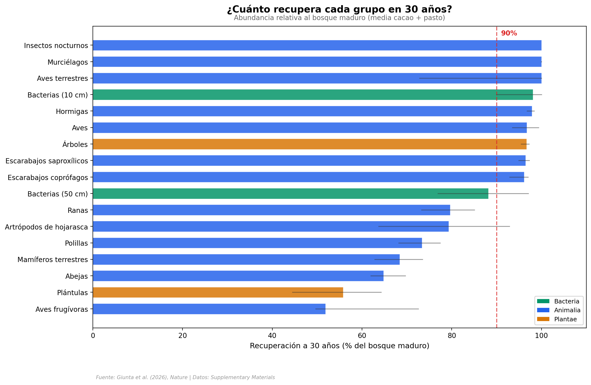

# Biodiversidad resiliente en un bosque tropical

¿Cuánto tarda un bosque tropical en volver a la vida? Un estudio en Ecuador midió la recuperación de 16 grupos taxonómicos — desde bacterias del suelo hasta murciélagos — en bosques que alguna vez fueron plantaciones de cacao o pastizales. Los resultados: la abundancia y la diversidad recuperan más del 90% en 30 años, pero la composición de especies (¿vuelven las *mismas* especies?) apenas alcanza el 75%.

**El hallazgo:** La velocidad de retorno importa entre 1× y 2,6× más que la resistencia a la perturbación. Grupos con resistencia casi nula (plántulas: 0%, árboles: 9%) aún así se recuperan gracias a que recolonizan rápido.

## Gráfica clave



## Reproducir

[](https://colab.research.google.com/github/Ciencia-a-Mordiscos/lab/blob/main/papers/2026-04-09-biodiversidad-resiliencia-bosque-tropical/notebook.ipynb)

O localmente:
```bash
pip install pandas matplotlib numpy scipy
jupyter execute notebook.ipynb
```

## Datos

- `datos/recuperacion_taxa.csv` — Recuperación, resistencia y velocidad de retorno para 17 taxa × 5 métricas × 2 legados (170 filas)
- `datos/importancia_lambda_resistencia.csv` — Ratios de importancia λ/R por métrica y legado (12 filas)
- `datos/parcelas.csv` — Metadatos de las 64 parcelas (coordenadas, tratamiento, año de regeneración)

## Links

- **Video:** [Pendiente]
- **Paper:** [Nature — DOI: 10.1038/s41586-026-10365-2](https://doi.org/10.1038/s41586-026-10365-2)
- **Datos originales:** [CodeOcean (10.24433/CO.1040081.v4)](https://doi.org/10.24433/CO.1040081.v4) + Supplementary Materials (Nature)
