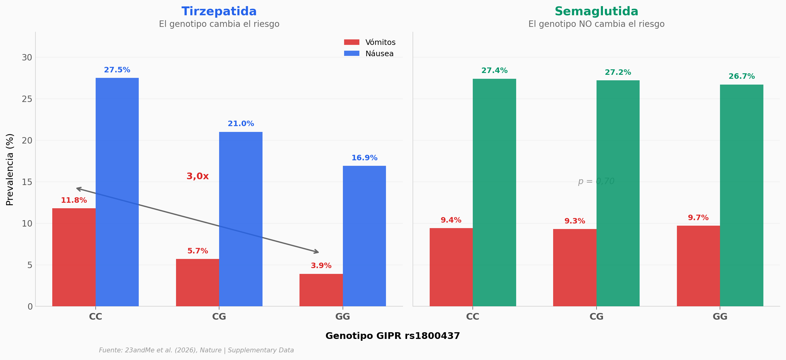

# Predictores genéticos de pérdida de peso con GLP1

27.885 personas tomaron semaglutida o tirzepatida. Una sola variante en el gen GIPR puede triplicar el riesgo de vómitos — pero solo con tirzepatida. Con semaglutida, la misma variante no tiene efecto.

**El hallazgo:** El genotipo CC de rs1800437 (GIPR) se asocia con 11,8% de prevalencia de vómitos en tirzepatida vs 3,9% del genotipo GG (3,0×, p = 2,2 × 10⁻¹⁰). En semaglutida: CC 9,4% vs GG 9,7% — sin diferencia. Un modelo predictivo que combina clínica + genética mejora la predicción de vómitos (AUC +0,022), pero apenas mueve la predicción de pérdida de peso (ΔR² = 0,001).

## Gráfica clave



## Reproducir

[](https://colab.research.google.com/github/Ciencia-a-Mordiscos/lab/blob/main/papers/2026-04-09-predictores-geneticos-glp1-perdida-peso/notebook.ipynb)

O localmente:
```bash
pip install pandas matplotlib numpy scipy
jupyter execute notebook.ipynb
```

## Datos

- `datos/efectos_genotipo.csv` — Prevalencia de náusea y vómitos por genotipo GIPR × fármaco (12 filas)
- `datos/resumen_farmacos.csv` — Demografía, cambio de IMC y efectos secundarios por fármaco y sexo (14 filas)
- `datos/variantes_gwas.csv` — 9 variantes con significancia genómica (índice) de 6 fenotipos
- `datos/modelo_eficacia.csv` — Coeficientes del modelo de eficacia (29 predictores)
- `datos/rendimiento_modelo.csv` — AUC/R² con y sin genética para 12 fenotipos
- `datos/gwas_peso_cambio.csv` — Summary statistics del GWAS de cambio de peso (1.626 variantes, p < 10⁻⁴)
- `datos/gwas_resumen_fenotipos.csv` — Resumen de señales GWAS significativas por fenotipo (39 fenotipos)

## Links

- **Video:** [Pendiente]
- **Paper:** [Nature — DOI: 10.1038/s41586-026-10330-z](https://doi.org/10.1038/s41586-026-10330-z)
- **Datos originales:** Supplementary Data (Nature) — Tables + GWAS Summary Statistics
