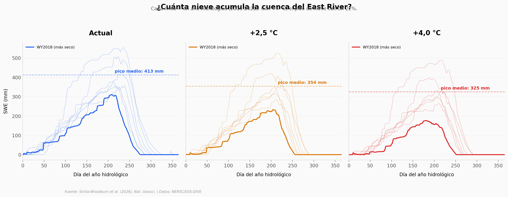

# El agua que sostiene los ríos de Colorado tiene 15 años

En las cabeceras del río Colorado, un modelo hidrogeológico de alta resolución revela que el calentamiento no solo derrite la nieve más rápido — todo apunta a que también está drenando reservas de agua subterránea que tardaron décadas o siglos en acumularse. Con +4 °C de calentamiento, la edad media del agua almacenada sube y el pico de nieve cae un 21%. Los datos de la estación USGS de Almont confirman que el caudal ya lleva décadas bajando (p = 0,009).

**El hallazgo:** Con cada grado de calentamiento, el agua subterránea que llega a los ríos de montaña es más vieja — el sistema consume reservas acumuladas durante décadas mientras la nieve que las recarga disminuye.

## Gráfica clave



## Reproducir

[](https://colab.research.google.com/github/Ciencia-a-Mordiscos/lab/blob/main/papers/2026-04-10-agua-subterranea-vieja-colorado/notebook.ipynb)

O localmente:
```bash
pip install pandas matplotlib numpy scipy
jupyter execute notebook.ipynb
```

## Datos

- `datos/swe_daily.csv` — Nieve diaria (SWE) por escenario, 7.650 registros (7 años × 3 escenarios)
- `datos/gw_storage_age_mu.csv` — Edad media del agua subterránea almacenada por escenario (7 años)
- `datos/streamflow_daily.csv` — Caudal simulado diario por escenario, 7.671 registros
- `datos/ecoslim_source_fractions.csv` — Fracción de nieve/lluvia en el caudal (EcoSLIM)
- `datos/discharge_annual.csv` — Caudal histórico anual USGS (1911-2024, 114 años)

## Links

- **Video:** [Pendiente]
- **Paper:** [Nature Geoscience — DOI: 10.1038/s41561-026-01945-y](https://doi.org/10.1038/s41561-026-01945-y)
- **Datos originales:** [NERSC EcoSLIM Portal](https://portal.nersc.gov/cfs/ecoslim/) + [ESS-DIVE](https://doi.org/10.15485/3013287) + [USGS](https://doi.org/10.5066/F7P55KJN)
