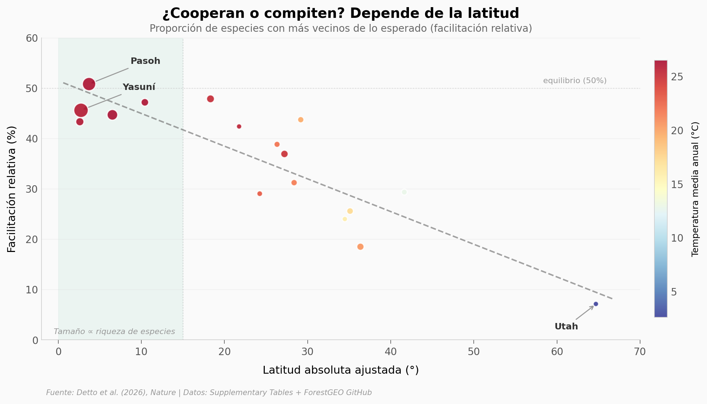

# La importancia de la competencia y la facilitación para la diversidad arbórea global

2,7 millones de árboles en 17 parcelas forestales, desde el ecuador hasta Utah. La competencia domina en el 88% de las parcelas, pero cerca del trópico las interacciones positivas y negativas están casi en equilibrio. A medida que aumenta la latitud, la facilitación se desploma: de 46% (ecuatorial) a 31% (templado), con un efecto enorme (Cohen's d = 1,50). La temperatura del suelo y la riqueza de especies son los mejores predictores de cooperación entre árboles.

**El hallazgo:** La facilitación relativa entre árboles cae de ~46% en el trópico a ~7% en Utah (ρ = −0,82, p < 0,001), un gradiente latitudinal no reconocido hasta ahora.

## Gráfica clave



## Reproducir

[](https://colab.research.google.com/github/Ciencia-a-Mordiscos/lab/blob/main/papers/2026-04-10-competencia-facilitacion-diversidad-arboles/notebook.ipynb)

O localmente:
```bash
pip install pandas matplotlib numpy scipy
jupyter execute notebook.ipynb
```

## Datos

- `datos/proporciones_relativas.csv` — Proporción relativa de facilitación por parcela, radio y métrica (272 filas)
- `datos/proporciones_absolutas.csv` — Proporciones absolutas de competencia y facilitación (136 filas)
- `datos/sitios_forestales.csv` — Metadatos de 17 parcelas ForestGEO (lat, temp, precipitación, riqueza)

## Links

- **Video:** [Pendiente]
- **Paper:** [Nature — DOI: 10.1038/s41586-026-10349-2](https://doi.org/10.1038/s41586-026-10349-2)
- **Datos originales:** [ForestGEO GitHub](https://github.com/mdetto/Positive-Interactions) + Supplementary Tables
