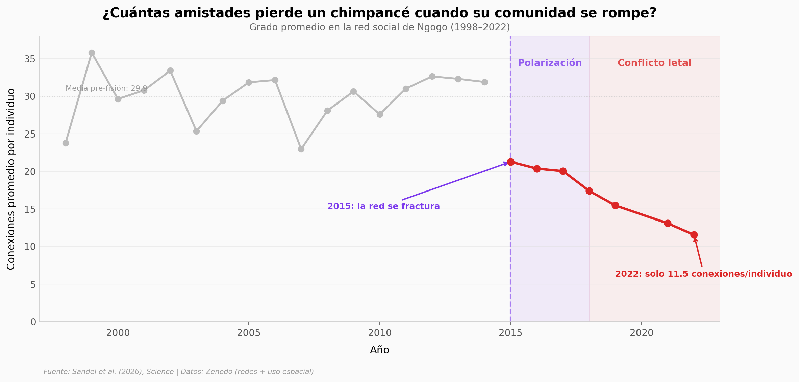

# Conflicto letal tras la fisión de un grupo de chimpancés salvajes

El grupo de chimpancés más grande jamás estudiado — casi 200 individuos en el Parque Nacional de Kibale, Uganda — se fracturó permanentemente en 2018. Lo que siguió fue una escalada de violencia letal sin precedentes en primates no humanos.

**El hallazgo:** Usando 30 años de datos de comportamiento y análisis de redes sociales, los investigadores documentaron cómo la conectividad social cayó un 67,7% (de 35,8 a 11,5 conexiones por individuo). Los machos del grupo Western lanzaron 24 ataques contra el grupo Central, matando al menos 7 machos adultos y 17 crías entre 2018 y 2024.

## Gráfica clave



## Reproducir

[](https://colab.research.google.com/github/Ciencia-a-Mordiscos/lab/blob/main/papers/2026-04-10-conflicto-letal-chimpances-fision/notebook.ipynb)

O localmente:
```bash
pip install pandas matplotlib numpy scipy
jupyter execute notebook.ipynb
```

## Datos

- `datos/grupo_composicion.csv` — Composición del grupo por año (West vs Central-East), 25 filas, 1998-2022
- `datos/red_social.csv` — Métricas de red social por año (avg_degree, density, edges), 24 filas, 1998-2022
- `datos/cluster_membership_by_year.csv` — Membresía individual por clúster y año, 77 filas

## Links

- **Video:** [Pendiente]
- **Paper:** [Science — DOI: 10.1126/science.adz4944](https://doi.org/10.1126/science.adz4944)
- **Datos originales:** [Zenodo 18626723](https://doi.org/10.5281/zenodo.18626723) (redes) · [Zenodo 18603419](https://doi.org/10.5281/zenodo.18603419) (uso espacial) · [Dryad](https://doi.org/10.5061/dryad.sf7m0cgkg)
