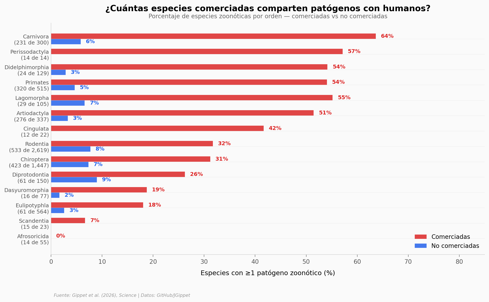

# El comercio de fauna silvestre y los patógenos que compartimos

Un tercio de los mamíferos silvestres del planeta han pasado por alguna forma de comercio — legal o ilegal. ¿Cuántos de esos animales comparten enfermedades con nosotros? Este notebook explora 40 años de datos de comercio internacional cruzados con registros de patógenos zoonóticos para 6.456 especies de mamíferos.

**El hallazgo:** Las especies comerciadas tienen 1,5 veces más probabilidad de compartir patógenos con humanos (ajustado por filogenia y esfuerzo de investigación). El comercio ilegal dispara el riesgo: el 72,4% de las especies comerciadas ilegalmente son zoonóticas.

## Gráfica clave



## Reproducir

[](https://colab.research.google.com/github/Ciencia-a-Mordiscos/lab/blob/main/papers/2026-04-11-comercio-fauna-patogenos-zoonoticos/notebook.ipynb)

O localmente:
```bash
pip install pandas matplotlib numpy scipy
jupyter execute notebook.ipynb
```

## Datos

- `datos/mamiferos_comercio_patogenos.csv` — 6.596 especies, 22 variables (comercio, patógenos, taxonomía, biogeografía)

## Links

- **Video:** [Pendiente]
- **Paper:** [Science — DOI: 10.1126/science.adw5518](https://doi.org/10.1126/science.adw5518)
- **Datos originales:** [GitHub — JGippet/WildlifeTrade_ZoonoticPathogens](https://github.com/JGippet/WildlifeTrade_ZoonoticPathogens) (CC-BY 4.0)
