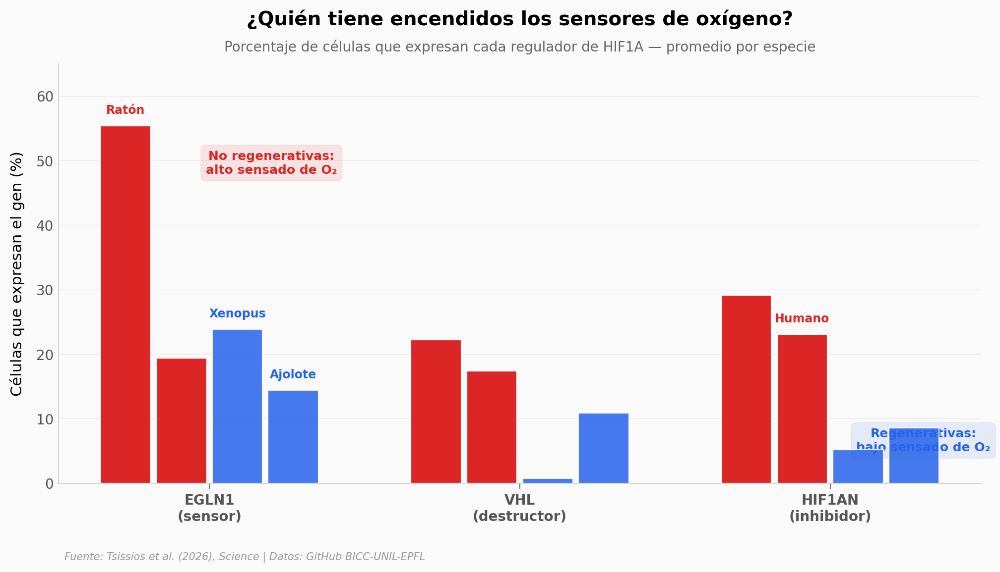

# ¿Por qué un ajolote regenera su pata y tú no?

Un equipo internacional comparó más de 21.000 células de 5 especies de vertebrados y descubrió que la diferencia entre regenerar una extremidad o no podría reducirse a una cosa: cómo las células detectan el oxígeno.

**El hallazgo:** Las especies regenerativas (rana *Xenopus* y ajolote) expresan hasta 29 veces menos los sensores de oxígeno (VHL, EGLN1, HIF1AN) que las no regenerativas (ratón, humano). Esto deja activo al factor de transcripción HIF1A, que enciende los programas de regeneración.

## Gráfica clave



## Reproducir

[](https://colab.research.google.com/github/Ciencia-a-Mordiscos/lab/blob/main/papers/2026-04-12-oxigeno-regeneracion-extremidades-vertebrados/notebook.ipynb)

O localmente:
```bash
pip install pandas matplotlib numpy openpyxl
jupyter execute notebook.ipynb
```

## Datos

- `datos/sensores_por_especie.csv` — Expresión promedio de 6 genes HIF1A × 5 especies (26 filas)
- `datos/sensores_oxigeno_especies.csv` — Expresión por estadio (68 filas)
- `datos/metabolismo_por_celula.csv` — Scores AUCell glucólisis/OxPhos (21.701 células)
- `datos/composicion_celular_tratamiento.csv` — Composición celular bajo tratamiento AER (18 tipos)

## Links

- **Video:** [Pendiente]
- **Paper:** [Science — DOI: 10.1126/science.adw8526](https://doi.org/10.1126/science.adw8526)
- **Datos originales:** [GitHub — BICC-UNIL-EPFL/multiSpecies_limbRegeneration](https://github.com/BICC-UNIL-EPFL/multiSpecies_limbRegeneration)
