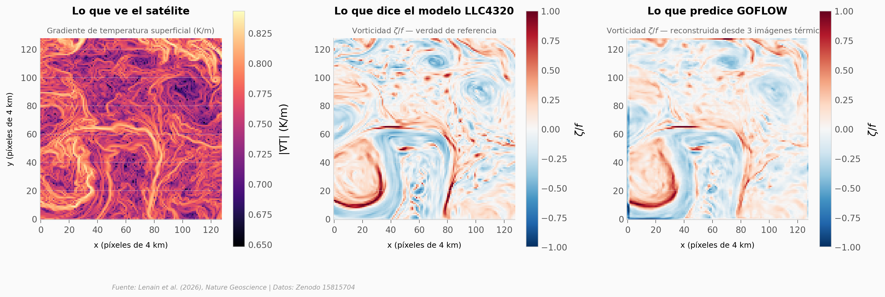

# Un satélite ve temperatura. ¿Puede ver las corrientes del océano?

Las corrientes submesoscale (1–10 km) mueven calor, nutrientes y CO₂ entre la superficie y las profundidades del océano. El problema: son demasiado finas para la altimetría satelital, y resolverlas con modelos globales cuesta millones de horas de cómputo. Un equipo de Scripps entrenó una red neuronal — GOFLOW — que aprende a inferir el campo de velocidad superficial a partir de tres imágenes consecutivas de temperatura desde satélites geostacionarios.

**El hallazgo:** Con tres snapshots térmicos separados por una hora, GOFLOW reconstruye velocidades (u, v) con correlación Pearson **r ≈ 0,97** contra la simulación de referencia LLC4320, y preserva la asimetría positiva de la vorticidad — el hallmark del régimen submesoscale — en 41 snapshots del test set del Gulf Stream.

## Gráfica clave



## Reproducir

[](https://colab.research.google.com/github/Ciencia-a-Mordiscos/lab/blob/main/papers/2026-04-13-goflow-corrientes-submesoscale/notebook.ipynb)

O localmente:
```bash
pip install pandas matplotlib numpy scipy
jupyter execute notebook.ipynb
```

## Datos

CSVs agregados en el servidor desde el dataset Zenodo (113 MB de NumPy arrays → 1,9 MB de CSVs):

- `datos/estadisticas_campos.csv` — stats globales (media, std, skewness, percentiles) para vorticidad, divergencia y deformación en LLC4320 (verdad) vs GOFLOW (predicción). 6 filas.
- `datos/pdf_campos.csv` — PDFs con 80 bins por variable para comparar distribuciones. 240 filas.
- `datos/correlacion_por_snapshot.csv` — Pearson *r* y RMSE de GOFLOW vs LLC4320 para 5 variables (u, v, ζ/f, δ/f, α/f) en cada uno de los 41 snapshots del test set. 205 filas.
- `datos/snapshot_representativo.csv` — snapshot *t* = 40 (la correlación de vorticidad más alta, *r* = 0,78) downsampled a 128×128 para visualización. 16.384 filas.

## Links

- **Video:** [Pendiente]
- **Paper:** [Lenain et al. (2026), *Nature Geoscience* — DOI: 10.1038/s41561-026-01943-0](https://doi.org/10.1038/s41561-026-01943-0)
- **Datos originales:** [Zenodo 15815704](https://doi.org/10.5281/zenodo.15815704)
- **Código del modelo:** [github.com/ksr-ocean/goflow](https://github.com/ksr-ocean/goflow)
