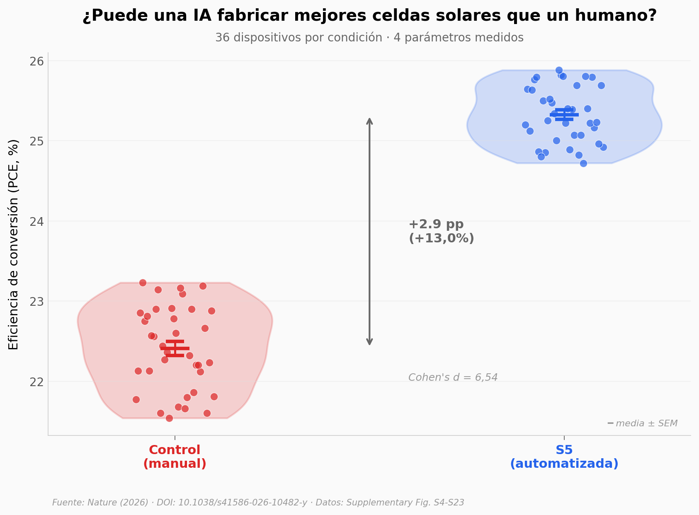

# Celdas solares de perovskita: cuando la IA fabrica mejor que el humano

Un equipo dejó que la inteligencia artificial descubriera nuevos materiales y fabricara celdas solares en un loop cerrado — sin intervención humana. Los 756 dispositivos fabricados por la plataforma automatizada superaron consistentemente a los controles manuales: +2,9 puntos porcentuales de eficiencia (22,4% → 25,3%), con un efecto estadístico enorme (Cohen's d = 6,54).

**El hallazgo:** Las 20 condiciones automatizadas superan a la fabricación manual. La ganancia viene del voltaje y el factor de llenado, no de la corriente.

## Gráfica clave



## Reproducir

[](https://colab.research.google.com/github/Ciencia-a-Mordiscos/lab/blob/main/papers/2026-04-14-celulas-solares-perovskita-ia-autonoma/notebook.ipynb)

O localmente:
```bash
pip install pandas matplotlib numpy scipy
jupyter execute notebook.ipynb
```

## Datos

- `datos/celdas_solares.csv` — 756 dispositivos, 21 condiciones, 4 parámetros (VOC, FF, JSC, PCE)

## Links

- **Video:** [Pendiente]
- **Paper:** [Nature — DOI: 10.1038/s41586-026-10482-y](https://doi.org/10.1038/s41586-026-10482-y)
- **Datos originales:** Supplementary Figures S4-S23 (Source Data)
