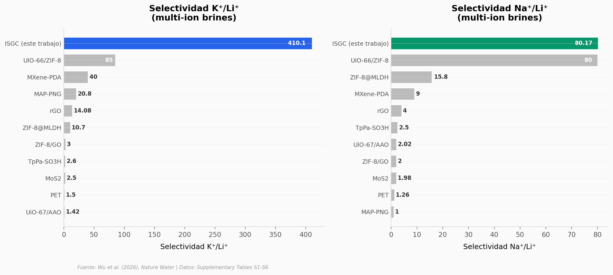

# Membranas selectivas de litio: 60× más que la mediana

Una membrana de vidrio compuesto (ISGC) inspirada en proteínas de transporte iónico logra separar litio de potasio y sodio con una selectividad sin precedentes en salmueras multi-iónicas — y lo hace con solo 1,02 kWh por kilogramo de Li₂CO₃.

**El hallazgo:** La membrana ISGC alcanza una selectividad K⁺/Li⁺ de 410 en salmueras multi-iónicas, 4,8 veces más que el mejor competidor y 60 veces más que la mediana del campo.

## Gráfica clave



## Reproducir

[](https://colab.research.google.com/github/Ciencia-a-Mordiscos/lab/blob/main/papers/2026-04-14-membranas-selectivas-litio/notebook.ipynb)

O localmente:
```bash
pip install pandas matplotlib numpy scipy
jupyter execute notebook.ipynb
```

## Datos

- `datos/selectividad_membranas.csv` — Selectividad iónica de 11 materiales de membrana (K⁺/Li⁺, Na⁺/Li⁺, K⁺/Na⁺)
- `datos/especies_ionicas.csv` — Diámetros bare e hidratados de 6 especies iónicas
- `datos/pals_membranas.csv` — Estructura de poro PALS para 5 composiciones ISGC
- `datos/comparacion_metodos.csv` — Comparación energética de 6 métodos de extracción de litio
- `datos/capex.csv` — Desglose CAPEX del sistema piloto

## Links

- **Video:** [Pendiente]
- **Paper:** [Nature Water — DOI: 10.1038/s44221-026-00633-w](https://doi.org/10.1038/s44221-026-00633-w)
- **Datos originales:** Supplementary Tables S1-S6 del paper
