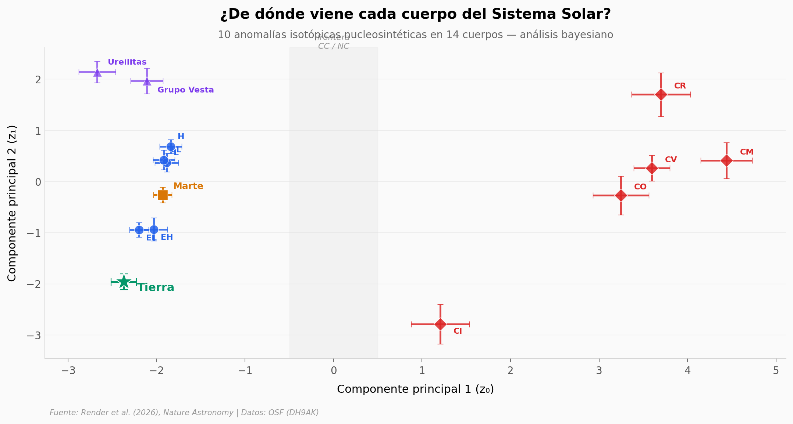

# ¿De qué está hecha la Tierra? De nada que conozcamos

La Tierra no se parece a ningún meteorito conocido. Un equipo analizó 10 anomalías isotópicas nucleosintéticas en 17 cuerpos del Sistema Solar para mostrar que la Tierra se formó exclusivamente de material del interior — sin contribución del Sistema Solar exterior. Más aún: es el endmember más extremo del array no-carbonáceo, y el modelo predice que Mercurio y Venus serían aún más extremos.

**El hallazgo:** La extensión lineal del array no-carbonáceo intersecta la composición de la Tierra dentro de 1 desviación estándar en todos los pares isotópicos — 0% de material exterior.

## Gráfica clave



## Reproducir

[](https://colab.research.google.com/github/Ciencia-a-Mordiscos/lab/blob/main/papers/2026-04-15-acrecion-homogenea-tierra-sistema-solar/notebook.ipynb)

O localmente:
```bash
pip install pandas matplotlib numpy scipy
jupyter execute notebook.ipynb
```

## Datos

- `datos/input_mlr.csv` — 17 cuerpos × 11 anomalías isotópicas con incertidumbres (OC-EC + meteoritos de hierro)
- `datos/bayesian_fig1.csv` — Coordenadas bayesianas (z₀, z₁) de 14 cuerpos del Sistema Solar

## Links

- **Video:** [Pendiente]
- **Paper:** [Nature Astronomy — DOI: 10.1038/s41550-026-02824-7](https://doi.org/10.1038/s41550-026-02824-7)
- **Datos originales:** [OSF — DH9AK](https://osf.io/dh9ak/)
