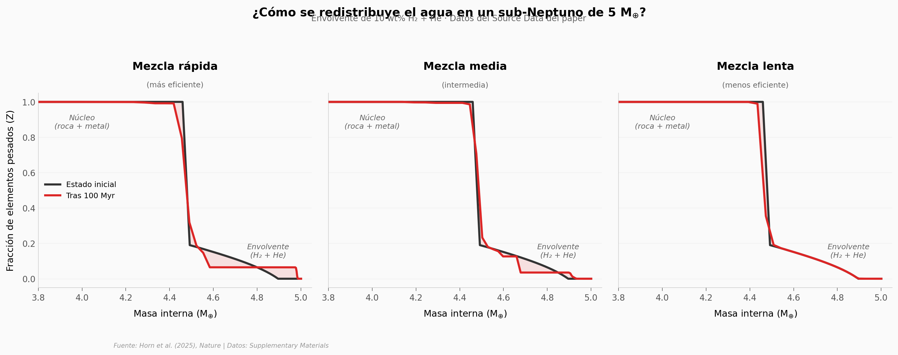

# Planetas húmedos sin migrar desde lejos

Un sub-Neptuno podría fabricar su propia agua — sin traerla de lejos. Experimentos con celda de yunque de diamante muestran que cuando el hidrógeno toca el magma a presiones extremas (8–42 GPa), se produce un **18,1% en peso de agua**. Esto es ~1.800 veces más de lo que predecían los modelos previos basados en datos a baja presión.

**El hallazgo:** La reacción hidrógeno-silicato a alta presión produce 18,1 ± 0,5 wt% de H₂O. Si solo el 5% exterior del núcleo rocoso de un sub-Neptuno reacciona, se generarían 2–4 wt% de agua — suficiente para que un planeta "seco" se convierta en "húmedo" sin necesidad de migración.

## Gráfica clave



## Reproducir

[](https://colab.research.google.com/github/Ciencia-a-Mordiscos/lab/blob/main/papers/2026-04-15-agua-sub-neptunos-reaccion-magma/notebook.ipynb)

O localmente:
```bash
pip install pandas matplotlib numpy
jupyter execute notebook.ipynb
```

## Datos

- `datos/evolucion_planetaria.csv` — Evolución de la fracción de elementos pesados (Z) vs masa interna para 3 escenarios de mezcla (150 puntos × 12 columnas)
- `datos/reacciones_experimentales.csv` — 24 parámetros experimentales clave (presión, temperatura, composición, agua producida)
- `datos/agua_por_composicion.csv` — Producción de agua según ratio Mg/Si del manto (3 escenarios)

## Links

- **Video:** [Ver en YouTube](https://youtube.com/shorts/P2ZOHqKeDFE)
- **Paper:** [Nature — DOI: 10.1038/s41586-025-09630-7](https://doi.org/10.1038/s41586-025-09630-7)
- **Datos originales:** [Zenodo](https://doi.org/10.5281/zenodo.15586691) (acceso restringido) + Supplementary Materials del paper
