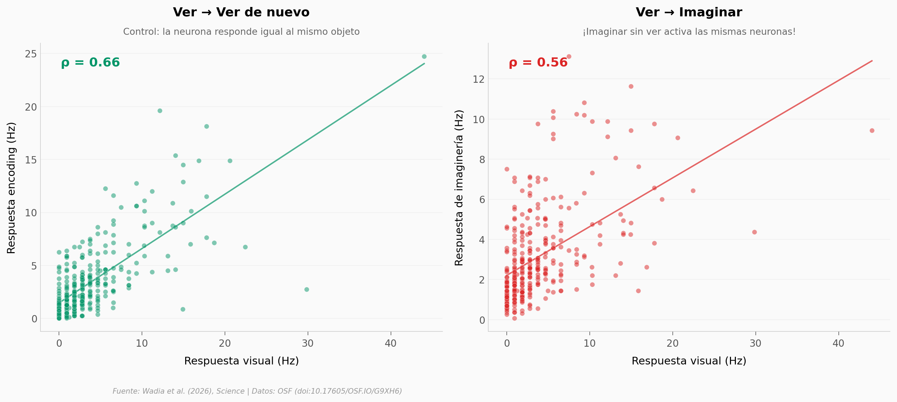

# Tu cerebro reutiliza el mismo código para ver e imaginar

Un equipo del Caltech y Cedars-Sinai grabó 367 neuronas individuales en la corteza temporal ventral (VTC) de 16 pacientes epilépticos. Primero les mostraron 500 objetos distintos; después les pidieron que los *imaginaran* sin verlos. Resultado: las neuronas que codifican objetos durante la percepción visual se reactivan durante la imaginería — el cerebro no inventa un código nuevo para imaginar, reutiliza el que ya tiene.

**El hallazgo:** A nivel de población, la correlación entre la respuesta visual y la de imaginería es ρ = 0,56 (n = 338 pares, p < 10⁻²⁸). El 74% de las neuronas testeadas durante imaginería muestran correlación positiva.

## Gráfica clave



## Reproducir

[](https://colab.research.google.com/github/Ciencia-a-Mordiscos/lab/blob/main/papers/2026-04-15-codigo-neural-percepcion-imaginacion/notebook.ipynb)

O localmente:
```bash
pip install pandas matplotlib numpy scipy
jupyter execute notebook.ipynb
```

## Datos

- `datos/neuronas_visuales.csv` — 367 neuronas axis-tuned (latencia, sparseness, tasas por categoría)
- `datos/perfil_ejemplo.csv` — Perfiles de respuesta de 3 neuronas selectivas (500 estímulos)
- `datos/vision_vs_imagineria.csv` — 338 pares estímulo-neurona (visual, encoding, imaginería)
- `datos/correlaciones_neuronas.csv` — Correlaciones por neurona (43 neuronas, visual→imaginería)

## Links

- **Video:** [Pendiente]
- **Paper:** [Science — DOI: 10.1126/science.adt8343](https://doi.org/10.1126/science.adt8343)
- **Datos originales:** [OSF — doi:10.17605/OSF.IO/G9XH6](https://doi.org/10.17605/OSF.IO/G9XH6)
