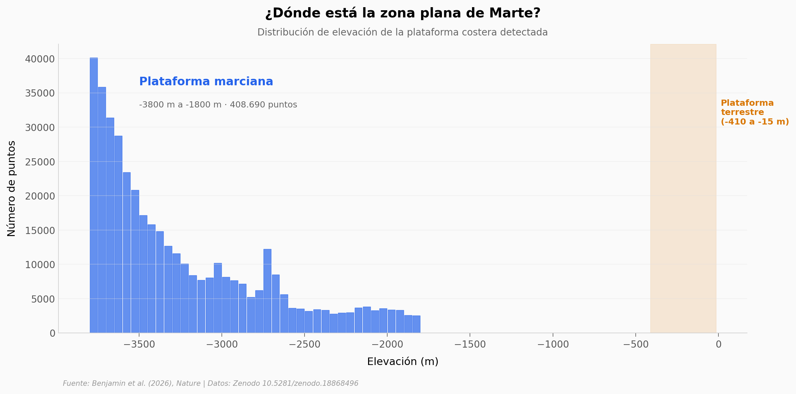

# ¿Tuvo Marte un océano? La firma que dejó en el suelo

Un equipo buscó la huella de un antiguo océano marciano no en líneas de costa —que varían kilómetros de elevación— sino en la topografía misma: una banda circunglobal de terreno anormalmente plano entre −3.800 m y −1.800 m. 408.690 puntos topográficos, 48 deltas fluviales y dos shorelines propuestas confirman el patrón.

**El hallazgo:** Una plataforma costera marciana de 2.000 m de rango — 5 veces más ancha que la terrestre — rodea el hemisferio norte. El 77% de los deltas caen dentro de esta zona.

## Gráfica clave



## Reproducir

[](https://colab.research.google.com/github/Ciencia-a-Mordiscos/lab/blob/main/papers/2026-04-15-firma-topografica-oceanos-marte/notebook.ipynb)

O localmente:
```bash
pip install pandas matplotlib numpy
jupyter execute notebook.ipynb
```

## Datos

- `datos/shelf_elevacion_hist.csv` — Distribución de elevación de la plataforma (40 bins)
- `datos/shelf_por_latitud.csv` — Estadísticas por banda de latitud (10 bandas)
- `datos/shorelines.csv` — Shorelines Arabia y Deuteronilus (10.619 puntos, subsample 1:5)
- `datos/deltas.csv` — 48 depósitos de delta con coordenadas y elevación
- `datos/rios_elevacion_hist.csv` — Distribución de ríos depositacionales (59 bins)

## Links

- **Video:** [Pendiente]
- **Paper:** [Nature — DOI: 10.1038/s41586-026-10381-2](https://doi.org/10.1038/s41586-026-10381-2)
- **Datos originales:** [Zenodo — 10.5281/zenodo.18868496](https://doi.org/10.5281/zenodo.18868496)
