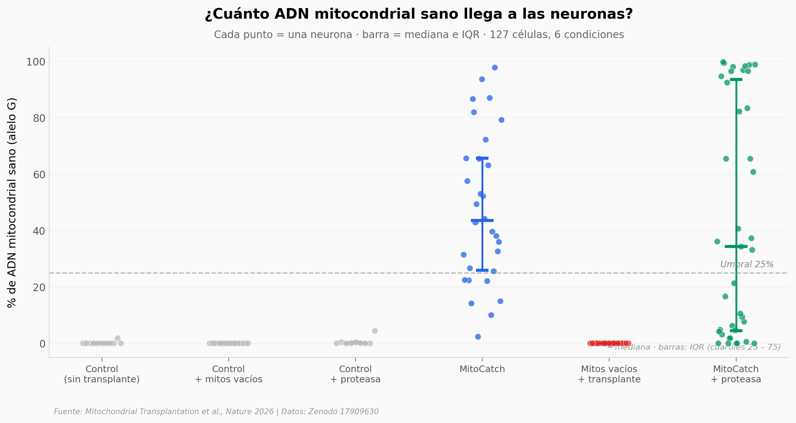

# Reparar una mitocondria enferma — célula por célula

Un equipo desarrolló **MitoCatch**, un sistema para entregar mitocondrias sanas solo a las células enfermas. Lo probaron en neuronas derivadas de un paciente con ceguera hereditaria (*neuropatía óptica hereditaria de Leber*, LHON), midiendo célula por célula cuánto ADN mitocondrial logró reemplazarse.

**El hallazgo:** en **23 de 30 neuronas** tratadas con MitoCatch, más del 25% del ADN mitocondrial pasó a ser la versión sana. La mediana fue **43,5%** — partiendo de un control pegado al 0%. Y sin los *binders* del sistema, la entrega no ocurre: 0% en 19 células control.

## Gráfica clave



## Reproducir

[](https://colab.research.google.com/github/Ciencia-a-Mordiscos/lab/blob/main/papers/2026-04-15-transplante-mitocondrial-dirigido/notebook.ipynb)

O localmente:
```bash
pip install pandas matplotlib numpy scipy
jupyter execute notebook.ipynb
```

## Datos

- `datos/nt_count_11778_matrix.csv` — 127 células, conteos A/G en la posición 11778 del mtDNA, etiquetadas por condición experimental (6 grupos, 2 rondas por grupo de tratamiento activo).

## Links

- **Video:** Pendiente
- **Paper:** [Nature — DOI: 10.1038/s41586-026-10391-0](https://doi.org/10.1038/s41586-026-10391-0)
- **Datos originales:** [Zenodo — 10.5281/zenodo.17909630](https://doi.org/10.5281/zenodo.17909630)
