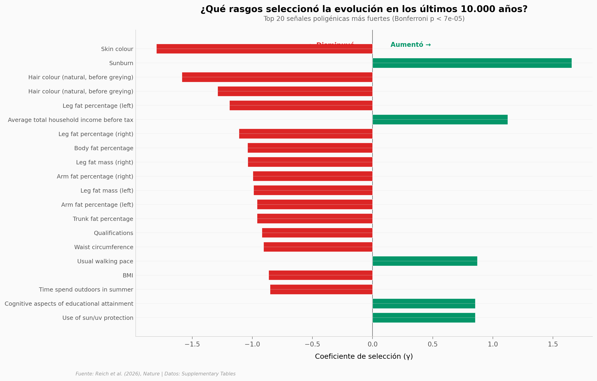

# ADN antiguo revela selección direccional masiva en Eurasia occidental

En los últimos 10.000 años, la selección natural no descansó. Un equipo liderado por David Reich analizó **15.836 genomas antiguos** de Eurasia occidental y encontró que cientos de alelos fueron seleccionados direccionalmente — no por migraciones o deriva, sino porque daban ventaja. Las señales más fuertes: pigmentación (piel y pelo más claros), grasa corporal (disminución) y, con matices, rendimiento cognitivo (aumento).

**El hallazgo:** 77 señales poligénicas Bonferroni-significativas entre 696 rasgos testeados. La pigmentación domina con γ = −1,80 (p = 5,7 × 10⁻⁷⁴) — la señal más extrema, a 5,4 desviaciones estándar de la media.

## Gráfica clave



## Reproducir

[](https://colab.research.google.com/github/Ciencia-a-Mordiscos/lab/blob/main/papers/2026-04-16-adn-antiguo-seleccion-direccional-eurasia/notebook.ipynb)

O localmente:
```bash
pip install matplotlib numpy
jupyter execute notebook.ipynb
```

## Datos

- `datos/seleccion_poligeica.csv` — 696 tests poligénicos de selección direccional (coeficiente γ, p-value, z-score)
- `datos/individuos_antiguos.csv` — 22.274 individuos antiguos (fecha BP, región, país, cobertura)

## Links

- **Video:** [Pendiente]
- **Paper:** [Nature — DOI: 10.1038/s41586-026-10358-1](https://doi.org/10.1038/s41586-026-10358-1)
- **Datos originales:** Supplementary Tables (Nature, 2026)
