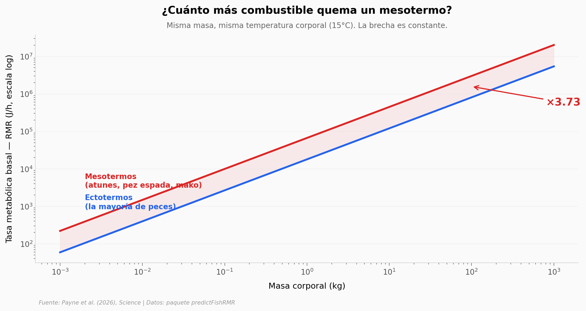

# El pez que se cocina a sí mismo cuando crece

Un atún rojo y un pez sapo del mismo peso, en la misma agua, queman cantidades muy distintas de combustible: el atún cuatro veces más. Payne y su equipo construyeron un modelo de producción y disipación de calor para peces, calibrado con 105 mediciones empíricas en 19 especies, desde una larva de 0.3 gramos hasta un tiburón ballena juvenil de 1.6 toneladas. Aquí re-derivamos las dos piezas centrales del paper a partir de los datos públicos del paquete `predictFishRMR`.

**El hallazgo:** Los mesotermos (atunes, pez espada, marrajo) gastan **3.73× más energía** que un ectotermo del mismo tamaño y temperatura corporal. Y como su producción de calor crece más rápido con la masa que su capacidad de disiparlo, **un mesotermo de 1000 kg acumula 24× más desbalance térmico** que uno de 1 kg. Por eso los mesotermos grandes viven en aguas frías y temperadas.

## Gráfica clave



## Reproducir

[](https://colab.research.google.com/github/Ciencia-a-Mordiscos/lab/blob/main/papers/2026-04-16-peces-mesotermicos-sobrecalentamiento/notebook.ipynb)

O localmente:
```bash
pip install pandas matplotlib numpy scipy
jupyter execute notebook.ipynb
```

## Datos

- `datos/kmass.csv` — 105 mediciones del coeficiente de enfriamiento K en 19 especies de peces (Nakamura, vía paquete `predictFishRMR`). Columnas: `species`, `M` (log₁₀ masa en kg), `K` (log₁₀ coeficiente de enfriamiento), `K_linear`. Rango de masa: 0.3 g → 1600 kg (6.7 órdenes de magnitud).
- `datos/fitted_model_rmr.csv` — 4 coeficientes del modelo Bayesiano del paper: `ln(RMR) = γ + α·ln(M_g) + β·Tm + ψ·meso`. Valores: γ=2.6776, α=0.8274, β=0.0932, ψ=1.3165.

## Links

- **Video:** [Ver en YouTube](https://youtube.com/shorts/51p2itg5FtY)
- **Paper:** [Mesothermic fishes face high fuel demands and overheating risk in warming oceans — Science, 2026](https://doi.org/10.1126/science.adt2981)
- **Datos originales:** [paquete predictFishRMR (Zenodo)](https://doi.org/10.5281/zenodo.16409669)
