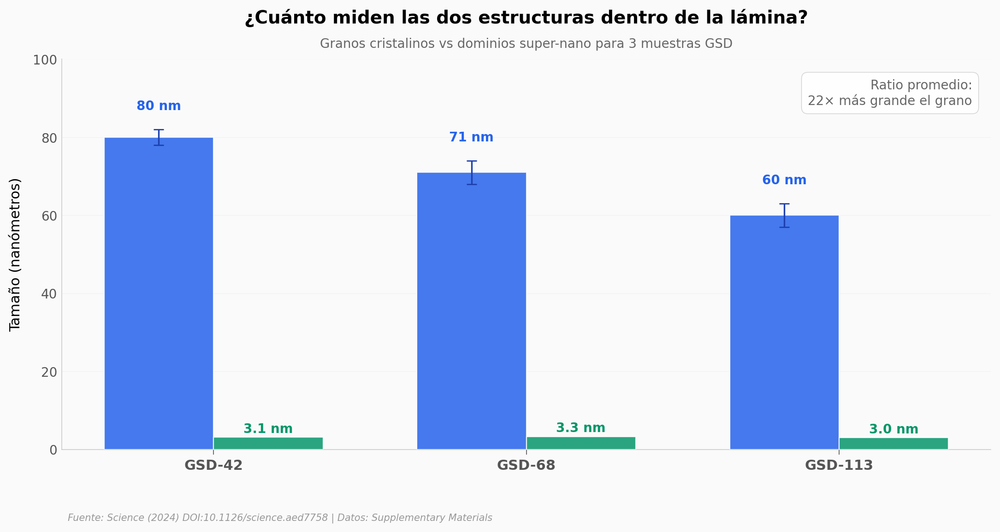

# Super-nano dominios en láminas de cobre — fuerza y conductividad sin sacrificar ninguna

Una lámina de cobre de **10 micras** que aguanta **~900 megapascales** de tensión y conduce el **90%** de lo que conduce el cobre puro. La clave está en una arquitectura de dos escalas: granos cristalinos de unas decenas de nanómetros con **dominios super-nano de ~3 nm** distribuidos periódicamente en su interior, fabricados por electrodeposición industrial.

**El hallazgo:** **Dos escalas estructurales independientes coexisten dentro del mismo material — granos ~70 nm y dominios ~3 nm (ratio 22×) — y eso permite que la lámina mantenga su dureza durante un mes a temperatura ambiente, mientras un cobre nanogranulado convencional pierde el 44% en sólo 24 horas.**

## Gráfica clave



## Reproducir

[](https://colab.research.google.com/github/Ciencia-a-Mordiscos/lab/blob/main/papers/2026-04-16-super-nano-domains-copper-foils/notebook.ipynb)

O localmente:

```bash
pip install pandas matplotlib numpy scipy
jupyter execute notebook.ipynb
```

## Datos

- `datos/composicion_quimica_gsd113.csv` — Composición elemental de GSD-113 medida por GDMS (Tabla S1). 8 elementos × 2 mediciones independientes.
- `datos/tamanos_estructurales.csv` — Tamaño de grano y de dominio super-nano para 3 muestras GSD (Fig. S4 A3/B3/C3).
- `datos/estabilidad_hardness.csv` — Microdureza Vickers de GSD-113 vs NG (Cu nanogranulado convencional) en 4 timepoints hasta 720 h (Fig. S7B, valores aproximados leídos de la figura).

## Links

- **Video:** [Ver en YouTube](https://youtube.com/shorts/6xG4ZxNHXhM)
- **Paper:** [Science (2024) — DOI: 10.1126/science.aed7758](https://doi.org/10.1126/science.aed7758)
- **Datos originales:** [Supplementary Materials (PDF)](https://www.science.org/doi/suppl/10.1126/science.aed7758/suppl_file/science.aed7758_sm.pdf)
