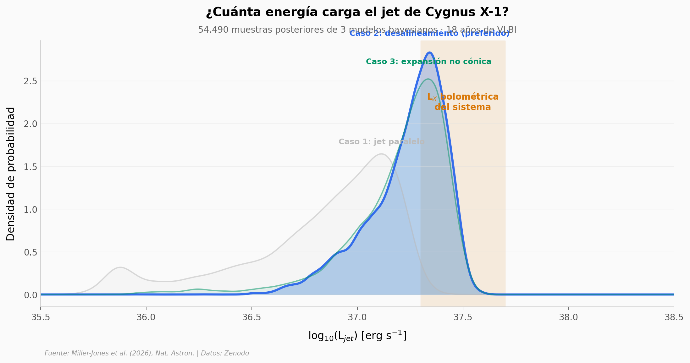

# ¿Cuánta energía esconde el chorro de un agujero negro?

Cygnus X-1 fue uno de los primeros agujeros negros confirmados. Con 18 años de observaciones de radiotelescopios de alta resolución (VLBI), un equipo detectó que el viento de la estrella compañera dobla el jet del agujero negro. Modelando esa interacción con inferencia bayesiana, midieron por primera vez la potencia cinética instantánea del jet.

**El hallazgo:** La potencia del jet es log₁₀(L_jet) = 37,28 erg/s (~1,9 × 10³⁷ erg/s), comparable a la luminosidad bolométrica en rayos X del sistema. El jet viaja a ~68% de la velocidad de la luz y está desalineado ~5° respecto al eje orbital.

## Gráfica clave



## Reproducir

[](https://colab.research.google.com/github/Ciencia-a-Mordiscos/lab/blob/main/papers/2026-04-17-jet-cygnus-x1-viento-estelar/notebook.ipynb)

O localmente:
```bash
pip install pandas matplotlib numpy scipy
jupyter execute notebook.ipynb
```

## Datos

- `datos/posteriors_all_cases.csv` — 54.490 muestras posteriores (3 casos), columnas: log₁₀(L_jet), β, halfOpenAngle, inclination
- `datos/model_comparison.csv` — Resumen de 3 modelos: logZ, medianas, descripciones
- `datos/observaciones.csv` — 19 épocas VLBI (1998–2016), instrumentos y duraciones
- `datos/jet_components.csv` — 5 componentes modelados del jet (1 core + 4 knots)

## Links

- **Video:** [Pendiente]
- **Paper:** [Nature Astronomy — DOI: 10.1038/s41550-026-02828-3](https://doi.org/10.1038/s41550-026-02828-3)
- **Datos originales:** [Zenodo](https://zenodo.org/records/18390870)
