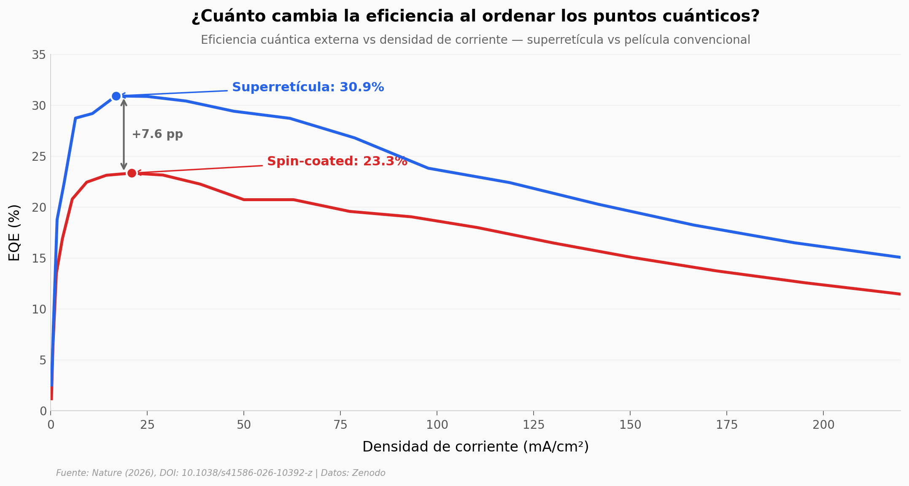

# LEDs de superretículas de quantum dots pixeladas

Los quantum dots de perovskita (CsPbBr₃) organizados en superretículas hexagonales producen LEDs con **30,9% de eficiencia cuántica externa**, **117.144 cd/m²** de luminancia y resolución de **5.080 PPI** — todo con una vida media extrapolada de **12.411 horas** (~1,4 años), más de 1.000× que el mejor LED pixelado de perovskita anterior.

**El hallazgo:** Un ligando (BHOA+F) que se adhiere 38% más fuerte permite ensamblar superretículas con transporte de banda — la movilidad es 17× mayor que la película convencional a temperatura ambiente.

## Gráfica clave



## Reproducir

[](https://colab.research.google.com/github/Ciencia-a-Mordiscos/lab/blob/main/papers/2026-04-17-pixelated-quantum-dot-superlattice-leds/notebook.ipynb)

O localmente:
```bash
pip install pandas matplotlib numpy scipy
jupyter execute notebook.ipynb
```

## Datos

- `datos/eqe_vs_j.csv` — EQE vs densidad de corriente (assembled vs spin-coated)
- `datos/eqe_distribution.csv` — Distribución EQE de 40 dispositivos por tipo
- `datos/mobility_vs_temperature.csv` — Movilidad vs temperatura (23 temperaturas)
- `datos/jvl_curves.csv` — Curvas J-V-L
- `datos/t50_benchmark.csv` — Ley de aceleración T50 (19 puntos)
- `datos/lifetime_decay.csv` — Decaimiento L/L₀ (235 puntos, 325 h)
- `datos/lifetime_vs_eqe.csv` — Benchmark: T50 vs EQE
- `datos/resolution_vs_eqe.csv` — Benchmark: resolución vs EQE
- `datos/binding_energies.csv` — Energías de enlace de 4 ligandos
- `datos/delta_e_transient.csv` — Desorden energético transitorio
- `datos/pl_stability_air.csv` — Estabilidad PL en aire (72 h)
- `datos/pl_stability_water.csv` — Estabilidad PL en agua (768 h)

## Links

- **Video:** [Pendiente]
- **Paper:** [Nature — DOI: 10.1038/s41586-026-10392-z](https://doi.org/10.1038/s41586-026-10392-z)
- **Datos originales:** [Zenodo](https://zenodo.org/records/15192789)
