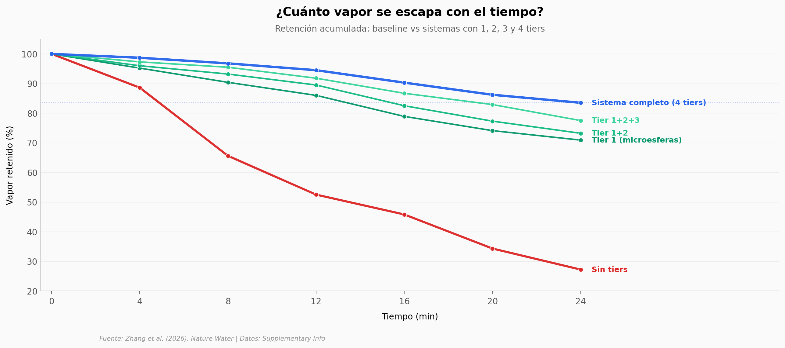

# Un termitero inspira cómo recuperar 83% del vapor industrial

Las torres de enfriamiento de centrales térmicas tiran litros de agua al aire cada segundo. El equipo de Zhang copió la arquitectura pasiva de los termiteros —cámaras, chimeneas y canales que enfrían sin perder humedad— para recuperar ese vapor. En laboratorio, el sistema de cuatro capas retiene 83,5% del vapor a los 24 minutos, contra 27,2% sin tratamiento.

**El hallazgo:** **Una sola capa** (el recubrimiento de microesferas FAUTO) aporta +43,7 puntos porcentuales de retención; las otras tres capas juntas añaden +12,6 pp.

## Gráfica clave



## Reproducir

[](https://colab.research.google.com/github/Ciencia-a-Mordiscos/lab/blob/main/papers/2026-04-21-vapor-agua-termitero-industrial/notebook.ipynb)

O localmente:

```bash
pip install pandas matplotlib numpy
jupyter execute notebook.ipynb
```

## Datos

- `datos/retention_vs_time.csv` — 7 timepoints (0–24 min) × 5 sistemas (baseline, tier1, tier1+2, tier1+2+3, sistema completo)
- `datos/wettability_coatings.csv` — 5 recubrimientos con ángulo de contacto y deslizamiento (Tabla SI 4)
- `datos/country_savings.csv` — 14 países con ratio de ahorro vs China (Fig. 5l del paper)
- `datos/thermal_conductivity.csv` — conductividad térmica de 5 muestras a 7 temperaturas (usado en la celda "Ahora tú")

## Links

- **Video:** Pendiente
- **Paper:** [Nature Water — DOI: 10.1038/s44221-026-00635-8](https://doi.org/10.1038/s44221-026-00635-8)
- **Datos originales:** [Supplementary Information (Springer)](https://static-content.springer.com/esm/art%3A10.1038%2Fs44221-026-00635-8/MediaObjects/44221_2026_635_MOESM6_ESM.xlsx)
