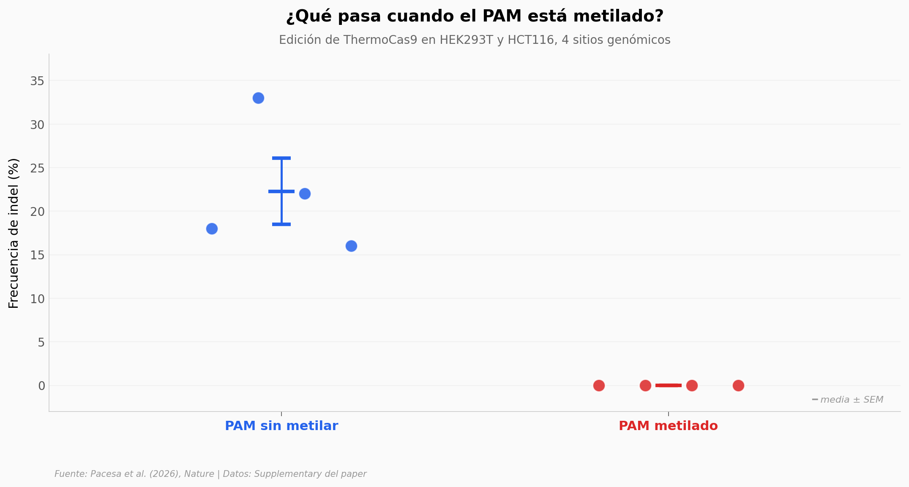

# Una sola metilación apaga la enzima

ThermoCas9, una variante de Cas9 que prefiere ADN sin metilar 12 veces más fuerte que el ADN metilado, podría editar selectivamente células de cáncer mientras deja en paz las células normales — porque las células sanas y las cancerosas se diferencian justamente en su patrón de metilación. El paper combina enzimología, edición en líneas celulares humanas y cuatro estructuras de crio-microscopía electrónica para reconstruir el mecanismo molecular.

**El hallazgo:** En 4 sitios genómicos × 2 líneas celulares, **ThermoCas9 no edita ningún sitio cuando el PAM está metilado** (0%) y edita entre 16-33% cuando no lo está. El ratio de afinidad in vitro es **12×** (Ki = 64 vs 767 nM).

## Gráfica clave



## Reproducir

[](https://colab.research.google.com/github/Ciencia-a-Mordiscos/lab/blob/main/papers/2026-04-22-cas9-metilacion-pam/notebook.ipynb)

O localmente:
```bash
pip install pandas matplotlib numpy
jupyter execute notebook.ipynb
```

## Datos

- `datos/indel_cellular.csv` — frecuencias de indel en HEK293T y HCT116, 4 sitios × 2 líneas (8 mediciones).
- `datos/ki_oligos.csv` — constantes de inhibición (Ki ± SE) para oligos no metilados vs metilados (2 condiciones).
- `datos/construct_editing.csv` — % reads modificadas en MCF-7 (cáncer) vs MCF-10A (normal) con WT vs catalíticamente reforzado.
- `datos/cryoem_resolutions.csv` — 4 estructuras crio-EM (PDB 9AR4-9AR7, EMDB 43769-43772) con resoluciones 2,2-3,5 Å.

## Links

- **Video:** [Pendiente]
- **Paper:** [Nature — DOI: 10.1038/s41586-026-10384-z](https://doi.org/10.1038/s41586-026-10384-z)
- **Estructuras:** PDB 9AR4-9AR7 · EMDB EMD-43769 a EMD-43772
