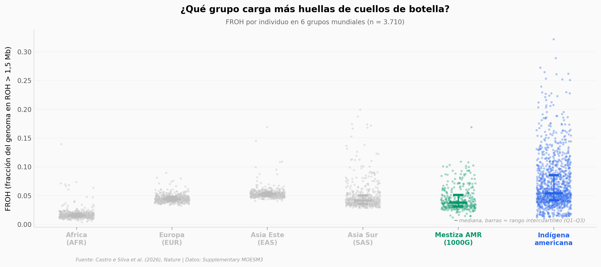

# 128 Genomas Indígenas Americanos: Dos Pistas Inesperadas

Un equipo de 85 investigadores acaba de publicar el mayor conjunto de genomas indígenas americanos secuenciados hasta hoy: 128 individuos de alta cobertura, 45 poblaciones, 8 países. Aquí exploramos tres preguntas con los datos agregados del paper — cuellos de botella demográficos, aislamiento por distancia, y la señal australasiática compartida con Papúa/Australia.

**El hallazgo:** El aislamiento por distancia *global* en América (Spearman ρ = 0,50) es una **paradoja de Simpson**: dentro de Sudamérica la correlación cae a 0,15 y entre Norte y Sudamérica es *negativa* (ρ = −0,29). No fue una sola ola migratoria.

## Gráfica clave



## Reproducir

[](https://colab.research.google.com/github/Ciencia-a-Mordiscos/lab/blob/main/papers/2026-04-22-genomas-indigenas-americanos/notebook.ipynb)

O localmente:
```bash
pip install pandas matplotlib numpy scipy
jupyter execute notebook.ipynb
```

## Datos

- `datos/tabla1_128_genomas.csv` — 128 individuos nuevos: población, cluster geográfico, familia lingüística, país, coordenadas.
- `datos/tabla4_roh_mundial.csv` — FROH por individuo en 3.710 genomas mundiales (1000G + indígenas americanos).
- `datos/tabla7_distancias.csv` — 1.378 pares de poblaciones con distancia geográfica y genética (*pairwise outgroup-f3*).
- `datos/tabla12_australasian_counts.csv` — número de tests D con |Z|>3 por población (36 antiguas, 114 contemporáneas).

Todos extraídos del Supplementary Information del paper (MOESM3). Los genomas individuales están en EGA bajo acceso controlado (EGAD50000002396).

## Links

- **Video:** [Pendiente]
- **Paper:** [Castro e Silva et al. (2026), *Nature*](https://doi.org/10.1038/s41586-026-10406-w)
- **Datos originales:** [Supplementary MOESM3 (Springer Nature)](https://static-content.springer.com/esm/art%3A10.1038%2Fs41586-026-10406-w/MediaObjects/41586_2026_10406_MOESM3_ESM.zip)
