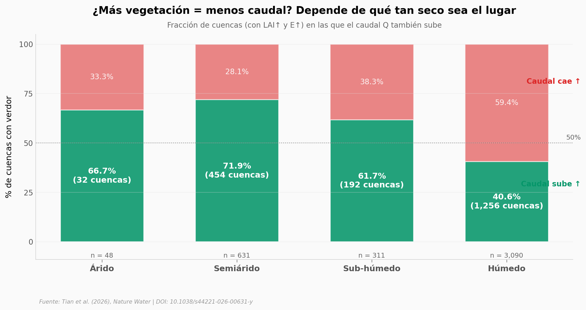

# Más vegetación, ¿menos caudal? Los datos dicen lo contrario en zonas secas

47,4% de las cuencas que se volvieron más verdes — y donde sube la evaporación — también llevan MÁS caudal, no menos. El patrón se invierte exactamente donde la teoría tradicional decía que sería peor: en zonas semiáridas y áridas. Tian et al. cruzaron 4.080 cuencas globales con simulaciones acopladas tierra–atmósfera y encontraron que el feedback atmosférico (menos albedo → más radiación → más convección → más lluvia) explica buena parte del fenómeno. Pero México es la excepción: ahí domina la humedad importada.

**El hallazgo:** **En el 71,9% de las cuencas semiáridas con verdor, el caudal sube en lugar de bajar.** El feedback atmosférico explica el 70,7% del aumento de precipitación en la Meseta de Loess y domina en 4 de 5 hotspots globales.

## Gráfica clave



## Reproducir

[](https://colab.research.google.com/github/Ciencia-a-Mordiscos/lab/blob/main/papers/2026-04-22-greening-no-seca-rios-semiaridos/notebook.ipynb)

O localmente:

```bash
pip install pandas matplotlib numpy
jupyter execute notebook.ipynb
```

## Datos

- `datos/cuencas_por_aridez.csv` — 4 filas, conteo de cuencas con verdor por aridez (Árido / Semiárido / Sub-húmedo / Húmedo) y por signo de Q.
- `datos/cuencas_lai_q_e.csv` — 4.080 filas, una por cuenca: `lai_slope`, `q_slope_mm_yr2`, `e_slope_mm_yr2`, `size_km2`. Todas con LAI↑ y E↑.
- `datos/lp_descomposicion.csv` — 3 filas, descomposición de la precipitación atribuida al verdor en la Meseta de Loess (Eficiencia, Externa, Local).
- `datos/regiones_descomposicion.csv` — 15 filas, misma descomposición aplicada a 5 hotspots: Meseta de Loess, India, Australia, México, Estados Unidos.
- `datos/serie_global_E_Q.csv` — 20 filas, serie temporal global de medianas E y Q con CIs.

## Links

- **Video:** Pendiente.
- **Paper:** [Tian et al. (2026), Nature Water — DOI: 10.1038/s44221-026-00631-y](https://doi.org/10.1038/s44221-026-00631-y)
- **Source Data:** Springer Nature MOESM3, MOESM6, MOESM7 (linkeados desde el paper).
