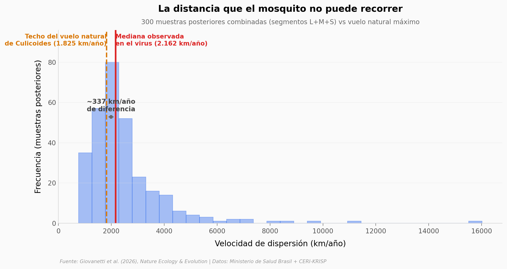

# Oropouche en Brasil: 9× más casos en un año

En 2023 Brasil reportó 831 casos confirmados de fiebre Oropouche, casi todos concentrados en la Amazonía. En 2024 fueron 7.931 — repartidos en 27 estados, llegando hasta la costa atlántica. El equipo del CERI-KRISP combinó filogeografía bayesiana con modelado de nicho ecológico para entender la dinámica de la expansión. Este notebook revisita los datos públicos: 8.762 casos individuales del Ministerio de Salud y las velocidades de dispersión estimadas para los tres segmentos del genoma viral.

**El hallazgo:** **El 66% de las velocidades de dispersión inferidas (199 de 300 muestras posteriores) cae por encima del techo del vuelo natural del jején vector — 1.825 km/año en línea recta.** El paper enmarca el transporte humano como rol *probable* (no causación) en saltos largos.

## Gráfica clave



## Reproducir

[](https://colab.research.google.com/github/Ciencia-a-Mordiscos/lab/blob/main/papers/2026-04-22-oropouche-expansion-brasil/notebook.ipynb)

O localmente:
```bash
pip install pandas matplotlib numpy
jupyter execute notebook.ipynb
```

## Datos

- `datos/casos_semanales.csv` — Casos OROV semanales en Brasil 2023-2024 (78 filas, agregado de 8.762 registros SINAN del Ministerio de Salud).
- `datos/casos_por_estado_anio.csv` — Casos por estado brasileño y año (38 filas, 11 estados en 2023 → 27 en 2024).
- `datos/occurrence_geographic.csv` — Ubicaciones (lon, lat) de detección de OROV en 3 momentos: pre-mid2023 (n=89), pre-2024 (n=133), acumulado 2024 (n=459).
- `datos/dispersal_velocities_by_segment.csv` — 300 muestras posteriores de velocidad de dispersión (km/año), 100 por segmento (L, M, S), derivadas de filogeografía bayesiana.

## Links

- **Video:** [Pendiente]
- **Paper:** [Nature Ecology & Evolution — DOI: 10.1038/s41559-026-03042-0](https://doi.org/10.1038/s41559-026-03042-0)
- **Datos originales:** [CERI-KRISP/OROV_Expansion_Dynamics_Ecology](https://github.com/CERI-KRISP/OROV_Expansion_Dynamics_Ecology)
- **Secuencias virales:** [NCBI GenBank](https://www.ncbi.nlm.nih.gov/nuccore/PQ149810)
