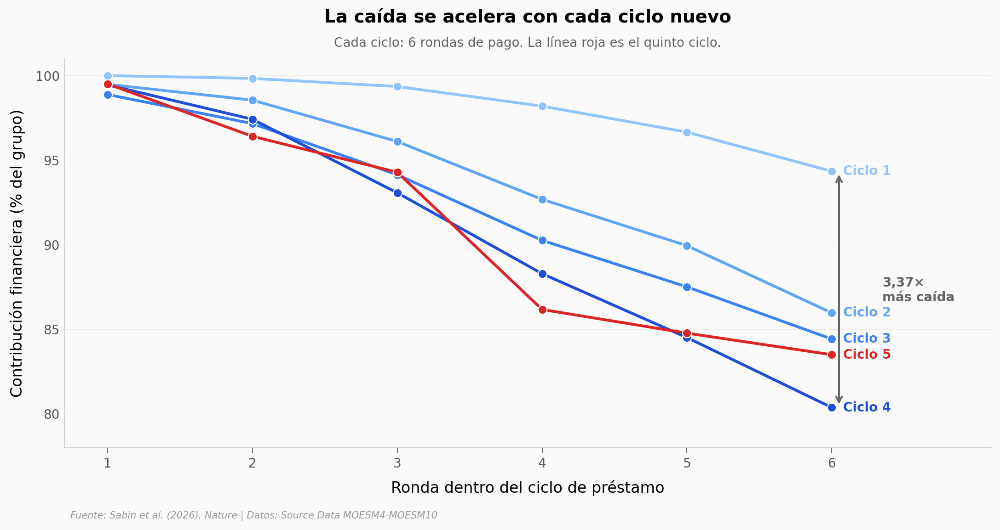

# La cooperación cae cada vez más rápido

47.931 pagos de 7.108 prestatarios en Sierra Leona, durante 5 años. Cada vez que un grupo termina su préstamo y empieza el siguiente, la cooperación rebota — y la siguiente caída es más empinada que la anterior. La motivación económica, la que la teoría racional clásica predice como dominante, resultó ser la menos mencionada por los entrevistados.

**El hallazgo:** La caída de la cooperación en el ciclo 4 es **3,37 veces** mayor que en el ciclo 1, en el mismo número de rondas. El reinicio 3 muestra un rebote post-restart de **+15,9σ** en cooperación financiera.

## Gráfica clave



## Reproducir

[](https://colab.research.google.com/github/Ciencia-a-Mordiscos/lab/blob/main/papers/2026-04-22-punctuated-decline-cooperation/notebook.ipynb)

O localmente:

```bash
pip install pandas matplotlib numpy
jupyter execute notebook.ipynb
```

## Datos

- `datos/decline_por_ciclo.csv` — 30 puntos (5 ciclos × 6 rondas), contribución financiera y esfuerzo cooperativo en %.
- `datos/restart_z_scores.csv` — 8 filas (4 reinicios × pre/post), z-scores y SE para financiero y esfuerzo.
- `datos/motivaciones.csv` — 4 categorías de motivación reportadas (n=128 menciones de 64 entrevistados).
- `datos/demografia_entrevistados.csv` — Composición demográfica (género, etnia, tipo de negocio) de los 64 entrevistados.

Todos derivados de los Source Data oficiales del paper (MOESM4, MOESM7, MOESM10).

## Links

- **Video:** [Pendiente]
- **Paper:** [Nature — DOI: 10.1038/s41586-026-10380-3](https://doi.org/10.1038/s41586-026-10380-3)
- **Datos originales:** [Source Data MOESM4-MOESM10](https://www.nature.com/articles/s41586-026-10380-3#Sec27) · Dataset canónico (no usado aquí, listado por reproducibilidad): [OSF](https://doi.org/10.17605/OSF.IO/26BFC)
