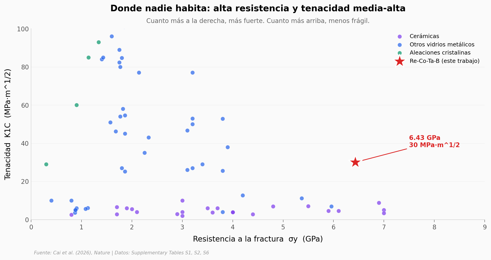

# Un vidrio con la fuerza del diamante y la tenacidad de un metal

Las cerámicas son resistentes pero frágiles; los metales son tenaces pero blandos. Cai et al. (2026) sintetizaron cinco vidrios metálicos masivos basados en renio-cobalto-tántalo-boro y midieron una combinación que hasta ahora estaba prácticamente desocupada en el plano resistencia-tenacidad: 6.43 GPa de fractura con 30 MPa·m^1/2 de tenacidad — el triple de tenacidad que cualquier cerámica de su nivel de resistencia. Este notebook reproduce su mapa Ashby con los datos del Supplementary Information y verifica claim por claim.

**El hallazgo:** El Re-Co-Ta-B alcanza **6.43 GPa de resistencia + 30 MPa·m^1/2 de tenacidad**, manteniendo **4.4 GPa a 900 K** (caída de solo 31.6%). Triplica la tenacidad de la mejor cerámica con resistencia comparable.

## Gráfica clave



## Reproducir

[](https://colab.research.google.com/github/Ciencia-a-Mordiscos/lab/blob/main/papers/2026-04-22-vidrio-metalico-resistencia-ceramica/notebook.ipynb)

O localmente:
```bash
pip install pandas matplotlib numpy scipy
jupyter execute notebook.ipynb
```

## Datos

- `datos/strength_toughness.csv` — Resistencia (σy) y tenacidad (K1C) de 23 cerámicas, 5 aleaciones cristalinas, 43 BMGs y el Re-Co-Ta-B (this work). 72 filas, transcrito de la Tabla S1 del Supplementary Information.
- `datos/strength_vs_temperature.csv` — Resistencia a compresión vs temperatura (303–1273 K) para 16 materiales representativos: superaleaciones, aleaciones refractarias, BMGs de referencia y este trabajo. 98 filas, Tabla S2.
- `datos/composiciones_re_co_ta_b.csv` — Las 5 composiciones Re-Co-Ta-B sintetizadas (Re1–Re5): %atómico, espesor crítico de colada, Tg, Tx, ΔTx. 5 filas, Tabla S6.

## Links

- **Video:** [Pendiente]
- **Paper:** [Nature — DOI: 10.1038/s41586-026-10430-w](https://doi.org/10.1038/s41586-026-10430-w)
- **Supplementary Information:** [PDF en Springer](https://static-content.springer.com/esm/art%3A10.1038%2Fs41586-026-10430-w/MediaObjects/41586_2026_10430_MOESM1_ESM.pdf)
