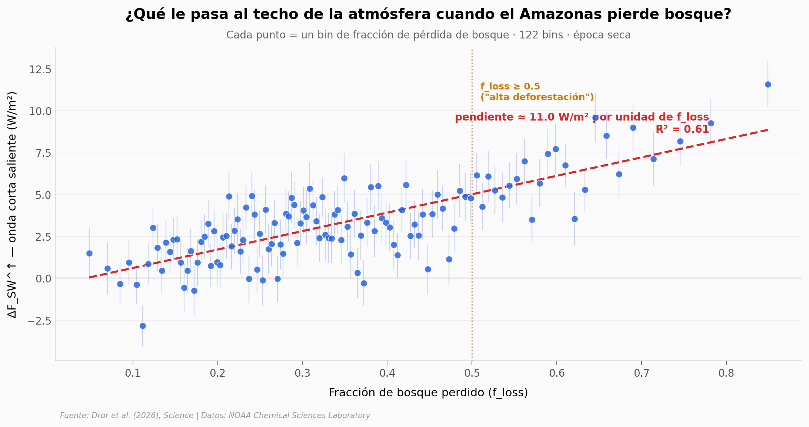

# El Amazonas que enfría: 6.8 W/m² de paradoja

Sobre el Amazonas, donde más bosque se ha perdido, el techo de la atmósfera devuelve **más** luz solar al espacio que sobre la selva intacta. Dos décadas de satélites (CERES y MODIS), 122 bins de fracción de pérdida de bosque, y una pregunta que el propio paper enmarca con cuidado: ¿qué significa este enfriamiento radiativo local cuando lo que liberas al deforestar es CO₂?

**El hallazgo:** En zonas de alta deforestación (f_loss ≥ 0.5), el flujo radiativo TOA en onda corta saliente es **6.8 ± 0.6 W/m²** mayor que sobre bosque intacto — y las nubes amplifican el efecto del albedo por **× 2.2** vs el cambio de suelo desnudo solo.

## Gráfica clave



## Reproducir

[](https://colab.research.google.com/github/Ciencia-a-Mordiscos/lab/blob/main/papers/2026-04-23-amazon-forest-cooling-feedback/notebook.ipynb)

O localmente:
```bash
pip install pandas matplotlib numpy scipy
jupyter execute notebook.ipynb
```

## Datos

- `datos/toa_flux_vs_forest_loss.csv` — 122 bins de f_loss con ΔF_SW, ΔF_LW (cada uno con SE 2σ), cambio en fracción nubosa (dCF) y cambio en altura de tope nuboso (dCTH). Estación seca, all-sky.
- `datos/feedback_summary.csv` — 24 valores resumen: 2 estaciones × 3 magnitudes (Fsw, Flw, albedo_toa) × 2 cielos (all-sky, surface-only) × 2 umbrales (f>0, f≥0.5).

Ambos archivos provienen del Supplementary del paper (NOAA Chemical Sciences Laboratory).

## Links

- **Video del canal:** [Pendiente]
- **Paper:** [Science — DOI: 10.1126/science.adz8296](https://doi.org/10.1126/science.adz8296)
- **Datos originales:** [NOAA CSL repository](https://csl.noaa.gov/groups/csl9/datasets/data/cloud_radiation/dror_feingold_amazon_2026/)
