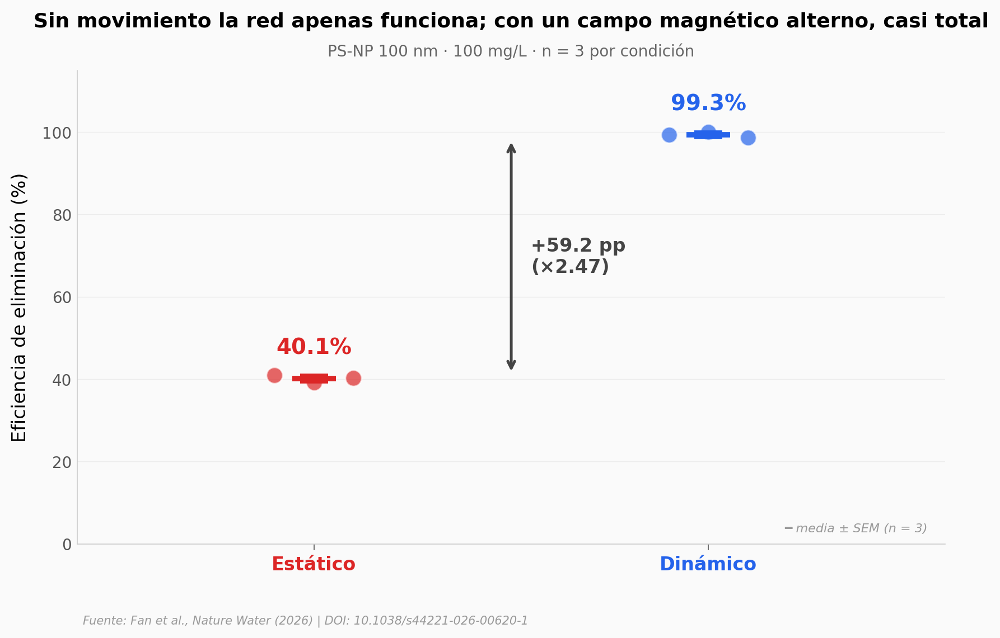

# Una red biohíbrida que se mueve y captura nanoplásticos

Un equipo del ETH Zürich construyó una red diminuta hecha de proteína de huevo (lisozima amiloide) decorada con partículas de óxido de hierro: las **LAF-IONPs**. Bajo un campo magnético alterno, la red se sacude y atrapa nanoplásticos de 30 a 1.000 nm con eficiencias del 94,6 al 99,6%, aguanta 100 ciclos de reuso manteniéndose por encima del 95%, y reduce un 91,5% del plástico bioacumulado en ratones C57BL/6.

**El hallazgo:** **El movimiento es el truco** — sin el campo magnético alterno la captura cae al 40,1%; con él sube al 99,3% (×2,47, Cohen d ≈ 71).

## Gráfica clave



## Reproducir

[](https://colab.research.google.com/github/Ciencia-a-Mordiscos/lab/blob/main/papers/2026-04-23-nanonets-amiloide-nanoplasticos/notebook.ipynb)

O localmente:

```bash
pip install pandas matplotlib numpy
jupyter execute notebook.ipynb
```

## Datos

- `datos/eficiencia_vs_concentracion.csv` — Eficiencia vs concentración inicial de PS-NP, 7 niveles (10–1.000 mg/L) × 3 réplicas. Derivado de Fig 4f.
- `datos/eficiencia_vs_tamano.csv` — Eficiencia vs tamaño de PS-NP (30 / 100 / 200 nm) × 3 réplicas. Derivado de Fig 4f.
- `datos/estatico_vs_dinamico.csv` — Eficiencia bajo régimen estático vs dinámico × 3 réplicas. Derivado de Fig 7c.
- `datos/ciclos_100.csv` — Eficiencia durante 100 ciclos de reciclado (medida cada 10 ciclos) × 3 réplicas. Derivado de Fig 7e.
- `datos/in_vivo_fluorescencia.csv` — Fluorescencia en tejido de ratones C57BL/6: Control, PS sin tratamiento, PS + LAF-IONPs (3 grupos × 3 individuos). Derivado de Fig 6f.
- `datos/aguas_reales_ciclos.csv` — Capacidad de adsorción normalizada (Q/Q₁) en piscina/lago/río/costa durante 5 ciclos × 3 réplicas.

## Links

- **Video:** [Pendiente]
- **Paper:** [Nature Water — DOI: 10.1038/s44221-026-00620-1](https://doi.org/10.1038/s44221-026-00620-1)
- **Datos originales:** [Source Data del paper en Springer Nature](https://static-content.springer.com/esm/art%3A10.1038%2Fs44221-026-00620-1/MediaObjects/)
