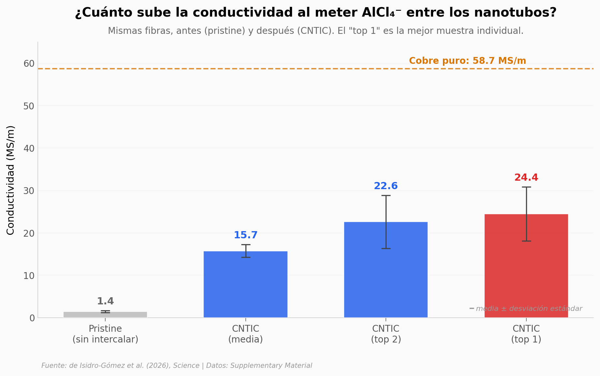

# Nanotubos intercalados con AlCl₄⁻: una fibra de carbono al 41% del cobre

Un equipo del IMDEA Materiales en España metió aniones de tetracloroaluminato (AlCl₄⁻) entre las paredes de fibras de nanotubos de carbono dobles. La conductividad pasó de 1.4 a 24.4 megasiemens por metro — un factor 17 sobre la misma fibra sin intercalar. Lo interesante es que el anión acepta 0.65 electrones por unidad, dejando huecos en el nanotubo exterior que aumentan los portadores de carga. El resultado: una fibra que pesa la mitad y aguanta cinco veces más que un cable de aluminio comercial, mientras conduce un 41% de lo que conduce el cobre.

**El hallazgo:** **24.4 MS/m, 41% del cobre, con la mitad del peso.** El AlCl₄⁻ funciona como dopante no covalente — una atracción electrostática, no un enlace químico — y eso permite que el efecto sea grande sin destruir la estructura del nanotubo.

## Gráfica clave



## Reproducir

[](https://colab.research.google.com/github/Ciencia-a-Mordiscos/lab/blob/main/papers/2026-04-23-nanotubos-carbono-conductividad/notebook.ipynb)

O localmente:

```bash
pip install pandas matplotlib numpy
jupyter execute notebook.ipynb
```

## Datos

Los seis CSV vienen del Supplementary Material del paper (PDF público de Science). El paper en sí está bajo paywall, pero las tablas que sostienen este análisis están todas en el SM:

- `conductividad_pristine_vs_intercalado.csv` — Tabla S5 — pristine vs CNTIC (4 filas)
- `dft_charges.csv` — Tabla S1 — cargas DFT por átomo, 4 unidades AlCl₄⁻ (20 filas)
- `raman_peak_shifts.csv` — Tabla S3 — picos Raman a 3 energías de laser (6 filas)
- `comparacion_intercalantes.csv` — Tabla S4 — 10 intercalantes ya probados en literatura
- `cable_materials.csv` — Tabla S6 — comparación con materiales de cable (Al, acero, fibra de carbono)
- `comparacion_cables_18mm.csv` — Tabla S7 — proyección del cable CNTIC vs cables comerciales

## Links

- **Video:** Pendiente — el corto de Ciencia a Mordiscos sobre este paper aún no se publica
- **Paper:** [Science — DOI: 10.1126/science.aeb0673](https://doi.org/10.1126/science.aeb0673)
- **Supplementary Material:** [PDF en science.org](https://www.science.org/doi/suppl/10.1126/science.aeb0673/suppl_file/science.aeb0673_sm.pdf)
- **Notebook renderizado:** [cienciaamordiscos.com](https://cienciaamordiscos.com/papers/2026-04-23-nanotubos-carbono-conductividad/notebook.html)
