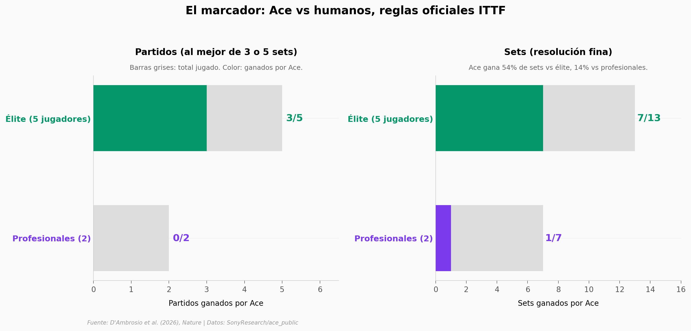

# Un robot le ganó 3 de 5 partidos a jugadores de élite en tenis de mesa

Sony construyó **Ace**, un robot autónomo con dos brazos KUKA y un controlador entrenado con aprendizaje por refuerzo. En abril de 2025 lo enfrentaron a siete humanos bajo reglas oficiales de la ITTF: cinco jugadores élite y dos profesionales japoneses. Contra los élite ganó 3 de 5 partidos. Contra los profesionales perdió los dos. En este notebook abrimos los 4.024 eventos registrados y miramos dónde aparece la brecha.

**El hallazgo:** **Ace cubre el 74% del juego humano en velocidad** (hasta 13,3 m/s, su p95). El 26% restante — los golpes más rápidos — siguen fuera de alcance.

## Gráfica clave



## Reproducir

[](https://colab.research.google.com/github/Ciencia-a-Mordiscos/lab/blob/main/papers/2026-04-24-robot-tenis-mesa-elite/notebook.ipynb)

O localmente:

```bash
pip install pandas matplotlib numpy scipy
jupyter execute notebook.ipynb
```

## Datos

- `datos/shots_clean.csv` — 1.953 golpes pre-procesados (970 de Ace, 983 humanos) con velocidad y spin magnitudes. Derivado del `match_data.csv` oficial.
- `datos/match_data.csv` — 4.024 eventos raw (golpes, rebotes y redes) con posición, velocidad y spin en 3D.

## Links

- **Video:** [Pendiente]
- **Paper:** [Nature — DOI: 10.1038/s41586-026-10338-5](https://doi.org/10.1038/s41586-026-10338-5)
- **Datos originales:** [SonyResearch/ace_public](https://github.com/SonyResearch/ace_public)
