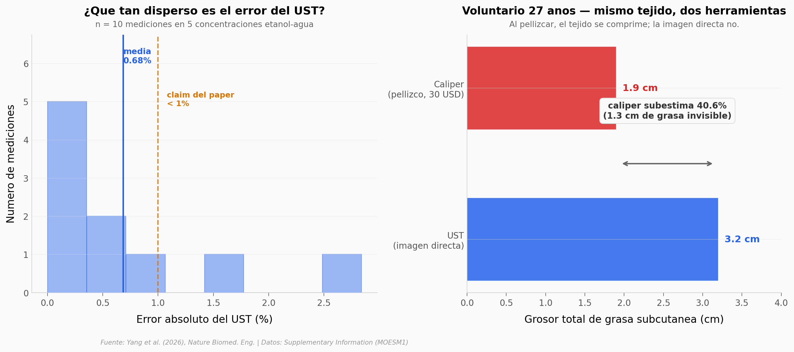

# Ultrasonido tomográfico del corte completo del cuerpo

El Ultrasonido de mano no puede ver más allá de la superficie del pellizco. Un equipo del MIT construyó un aro de 60 cm con 512 receptores que genera una imagen del corte transversal completo — abdomen o muslos — en reflexión y transmisión. Lo validaron en tres niveles: líquido conocido (mezclas etanol-agua), fantasma de grasa sintética (manteca sobre agar), y humanos contra resonancia magnética. Y algo más incómodo: mostraron que un caliper de $30 subestima la grasa hasta un 40 %.

**El hallazgo:** **UST coincide con MRI dentro de 3 mm (r = 0,987, n = 6). El caliper de consulta subestima 1,3 cm de grasa en un voluntario promedio — el tejido se comprime al pellizcar, la imagen directa no.**

## Gráfica clave



## Reproducir

[](https://colab.research.google.com/github/Ciencia-a-Mordiscos/lab/blob/main/papers/2026-04-24-ultrasonido-tomografia-corte-completo/notebook.ipynb)

O localmente:

```bash
pip install pandas matplotlib numpy scipy
jupyter execute notebook.ipynb
```

## Datos

Las tablas del Supplementary Information del paper, transcritas a CSV. El dataset crudo (14 GB de sinogramas en Figshare) no se usa aquí porque requiere código de reconstrucción propietario.

- `datos/ethanol_validacion.csv` — 5 mezclas etanol-agua (5–60 %), velocidad del sonido medida con UST (unmasked + masked) vs referencia con transductor de un solo elemento.
- `datos/adipose_fantasma.csv` — 2 espesores de manteca sobre agar (1 cm y 2 cm), ground truth con cinta plástica.
- `datos/adipose_ust_vs_mri.csv` — 6 líneas de perfil en 3 planos abdominales, grosor de grasa UST vs MRI 3T.
- `datos/adipose_calipers_vs_ust.csv` — 2 voluntarios (25F, 27M), grosor de grasa con caliper de pliegue vs UST.

## Links

- **Video:** [Pendiente]
- **Paper:** [Nature Biomedical Engineering — DOI: 10.1038/s41551-026-01660-4](https://doi.org/10.1038/s41551-026-01660-4)
- **Datos originales:** [Supplementary Information (MOESM1)](https://static-content.springer.com/esm/art%3A10.1038%2Fs41551-026-01660-4/MediaObjects/41551_2026_1660_MOESM1_ESM.pdf) · [Dataset crudo en Figshare](https://doi.org/10.6084/m9.figshare.31043818.v2)
