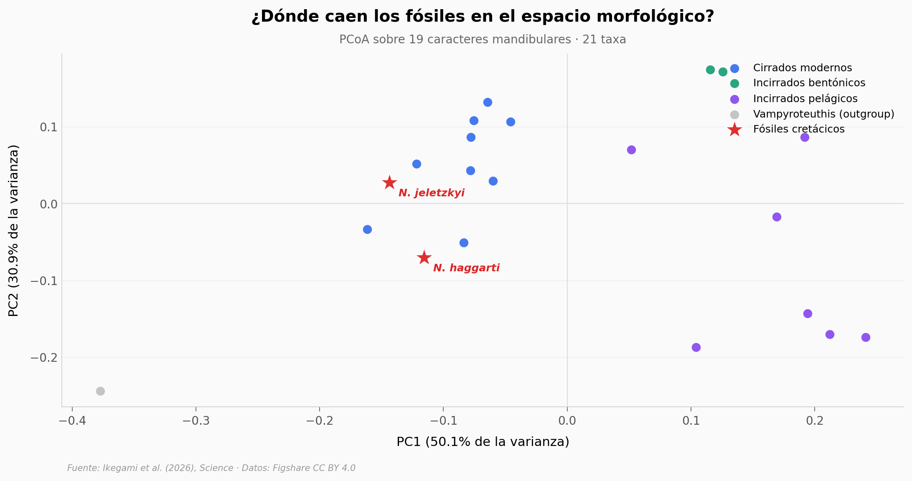

# Pulpos gigantes del Cretácico: ¿quiénes eran?

Hace 100 millones de años, los océanos tenían cefalópodos de hasta 19 metros depredando como apex. Durante 370 millones de años, los apex marinos han sido vertebrados — entonces ¿quiénes eran estos invertebrados gigantes?

**El hallazgo:** Los datos morfológicos colocan a los dos fósiles cretácicos (*Nanaimoteuthis jeletzkyi* y *N. haggarti*) **dentro del cluster de los cirrados modernos** — el linaje de los pulpos Dumbo de aguas profundas — y no con los incirrados (el linaje del *Octopus* común). 9 de 9 cirrados modernos están más cerca morfológicamente de los fósiles que cualquiera de los 10 no-cirrados (Mann-Whitney U=0, p=0,0003; Cohen's d=4,5).

## Gráfica clave



## Reproducir

[](https://colab.research.google.com/github/Ciencia-a-Mordiscos/lab/blob/main/papers/2026-04-25-octopodos-gigantes-cretacico/notebook.ipynb)

O localmente:
```bash
pip install pandas matplotlib numpy
jupyter execute notebook.ipynb
```

## Datos

- `datos/morphospace_pcoa.csv` — 21 taxa con coordenadas PC1, PC2, grupo y edad. PC1 explica 50,1% de la varianza, PC2 30,9% (total 81,1%).
- `datos/distancia_gower_a_fosiles.csv` — 19 cefalópodos modernos con distancia Gower a cada fósil cretácico y promedio.

## Links

- **Video:** Pendiente
- **Paper:** [Science — DOI: 10.1126/science.aea6285](https://doi.org/10.1126/science.aea6285)
- **Datos originales:** [Figshare — doi.org/10.6084/m9.figshare.29561630](https://doi.org/10.6084/m9.figshare.29561630) (CC BY 4.0)
