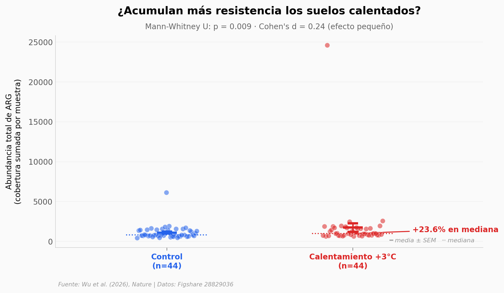

# +23,9 % más genes de resistencia a antibióticos en un suelo calentado 3°C

Un experimento de pradera en Oklahoma mantuvo el suelo 3°C por encima del control durante 11 años (2010–2020). Cuando los autores secuenciaron el ADN del suelo en 88 muestras finales, la abundancia de genes de resistencia a antibióticos (ARG) salió **+23,9 %** por encima en las parcelas calentadas. El efecto es modesto en magnitud (Cohen's d = 0,24) pero consistente: en los 11 de los 11 años de muestreo la mediana del grupo calentado supera a la control. Las clases más afectadas son **glicopéptidos y rifamicinas** — dos antibióticos que los hospitales reservan para infecciones difíciles.

**El hallazgo:** Calentar 3°C un suelo durante una década, sin tocar antibióticos, basta para que el resistoma del suelo crezca de forma significativa. La inferencia mecanística del paper apunta a co-selección con genes de tolerancia térmica.

## Gráfica clave



## Reproducir

[](https://colab.research.google.com/github/Ciencia-a-Mordiscos/lab/blob/main/papers/2026-04-27-calentamiento-resistencia-suelos/notebook.ipynb)

O localmente:

```bash
pip install pandas matplotlib numpy scipy
jupyter execute notebook.ipynb
```

## Datos

- `datos/abundancia_total.csv` — Abundancia total de ARG (cobertura sumada) por muestra. 88 filas (44 calentadas + 44 control).
- `datos/clases_antibiotico.csv` — Resumen por clase de antibiótico: medianas, % cambio, p-value Mann-Whitney. 10 clases.
- `datos/clases_largo.csv` — Formato largo (muestra × clase × abundancia) para las 6 clases con más datos. ~520 filas.
- `datos/series_temporales.csv` — Mediana y media anual por tratamiento, 2010–2020.

## Links

- **Video:** [Pendiente]
- **Paper:** [Wu et al. (2026), *Nature* — DOI: 10.1038/s41586-026-10413-x](https://doi.org/10.1038/s41586-026-10413-x)
- **Datos originales:** [Figshare 28829036](https://doi.org/10.6084/m9.figshare.28829036)
- **Código análisis (autores):** [Linwei-Wu/warming_soil_resistome](https://github.com/Linwei-Wu/warming_soil_resistome)
